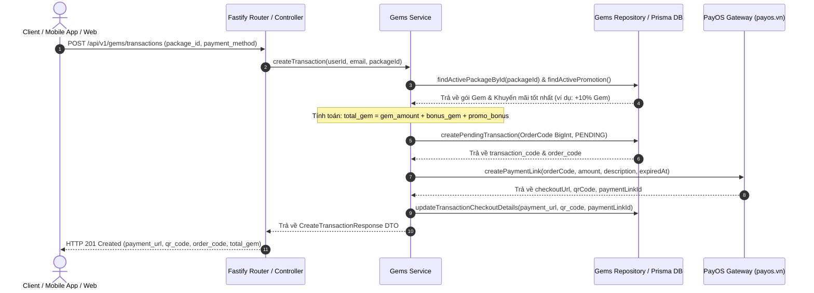
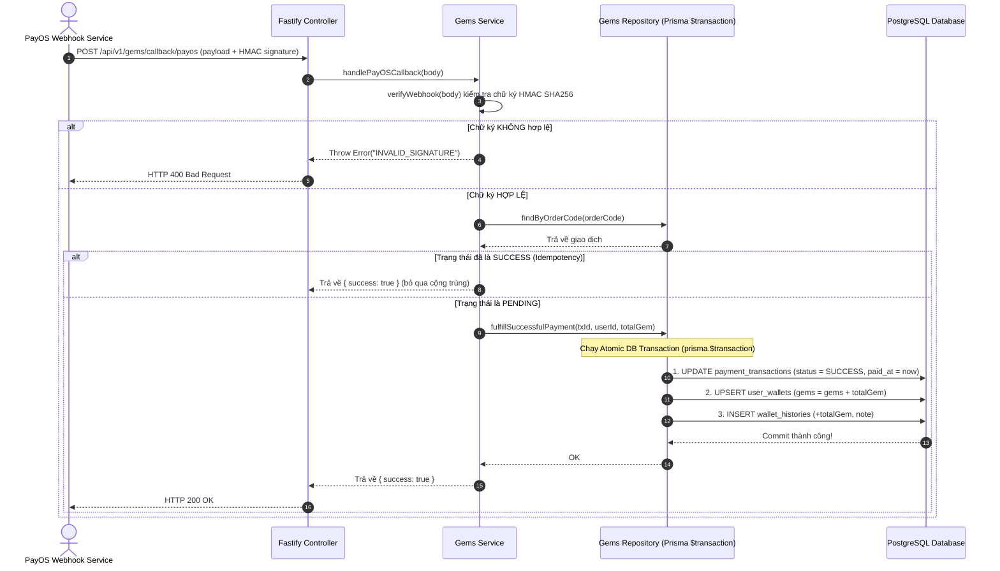

# BÁO CÁO TỔNG QUAN VÀ CHI TIẾT TRIỂN KHAI  
## MODULE NẠP GEM & QUẢN LÝ VÍ (GEM RECHARGE & WALLET MODULE v3 - PAYOS EDITION)

---

## 📌 MỤC LỤC
1. [Giới Thiệu & Kiến Trúc Tổng Quan](#1-giới-thiệu--kiến-trúc-tổng-quan)
2. [Thiết Kế Cơ Sở Dữ Liệu (Database Schema)](#2-thiết-kế-cơ-sở-dữ-liệu-database-schema)
3. [Luồng Xử Lý & Đồ Họa Sequence Diagram (Flow Chart)](#3-luồng-xử-lý--đồ-họa-sequence-diagram-flow-chart)
4. [Chi Tiết Cấu Trúc Mã Nguồn (Code Architecture)](#4-chi-tiết-cấu-trúc-mã-nguồn-code-architecture)
5. [Cơ Chế Bảo Mật & An Toàn Dữ Liệu](#5-cơ-chế-bảo-mật--an-toàn-dữ-liệu)
6. [Hướng Dẫn Thử Nghiệm API Trên Postman](#6-hướng-dẫn-thử-nghiệm-api-trên-postman)
7. [Kết Quả Kiểm Thử Tự Động (Automated Testing)](#7-kết-quả-kiểm-thử-tự-động-automated-testing)
8. [Tóm Tắt Nhánh Git & Lịch Sử Commit](#8-tóm-tắt-nhánh-git--lịch-sử-commit)

---

## 1. GIỚI THIỆU & KIẾN TRÚC TỔNG QUAN

Module **Nạp Gem & Quản Lý Ví (Gem Recharge & Wallet Module v3)** được xây dựng nhằm cung cấp hệ thống nạp Gem, quản lý biến động số dư và ghi nhận lịch sử ví người dùng cho ứng dụng học ngôn ngữ **KujiLingo**. 

### 🌟 Đặc điểm nổi bật:
* **Chuẩn hóa Kiến trúc Modular**: Tuân thủ 100% cấu trúc thiết kế của các module chuẩn trước đó (`favorite-vocabularies`, `folder`, `grammar`).
* **Cổng Thanh Toán PayOS (payos.vn)**: Hỗ trợ thanh toán nhanh bằng **Mã VietQR PRO** hoặc **Chuyển khoản Ngân hàng 24/7 (Napas 247)**. Đồng thời sẵn sàng mở rộng cổng Ví **MoMo**.
* **Xác thực Chữ ký HMAC-SHA256**: Đảm bảo các callback bất đồng bộ (Webhook) từ cổng thanh toán không bị giả mạo.
* **Xử lý An toàn Dữ liệu (Atomic Transaction & Idempotency)**: Đảm bảo tính toàn vẹn số dư ví, chống tình trạng cộng tiền/Gem trùng lặp khi nhận Webhook nhiều lần.

---

## 2. THIẾT KẾ CƠ SỞ DỮ LIỆU (DATABASE SCHEMA)

### 📊 Các Bảng Dữ Liệu Liên Quan (`prisma/schema.prisma`)

```prisma
enum PaymentMethod {
  MOMO
  PAYOS
}

enum PaymentStatus {
  PENDING
  SUCCESS
  FAILED
  CANCELLED
  EXPIRED
  REFUNDED
}

model gem_packages {
  id           String   @id @default(uuid()) @db.Uuid
  title        String
  description  String?
  gem_amount   Int
  bonus_gem    Int      @default(0)
  price        Decimal  @db.Decimal(12, 2)
  image        String?
  is_popular   Boolean  @default(false)
  is_best_value Boolean @default(false)
  sort_order   Int      @default(0)
  is_active    Boolean  @default(true)
  created_at   DateTime @default(now())
}

model gem_promotions {
  id            String   @id @default(uuid()) @db.Uuid
  title         String
  description   String?
  bonus_percent Int
  start_at      DateTime
  end_at        DateTime
  is_active     Boolean  @default(true)
  created_at    DateTime @default(now())
}

model payment_transactions {
  id                      String        @id @default(uuid()) @db.Uuid
  user_id                 String        @db.Uuid
  package_id              String?       @db.Uuid
  promotion_id            String?       @db.Uuid
  payment_method          PaymentMethod @default(PAYOS)
  payment_status          PaymentStatus @default(PENDING)
  amount                  Decimal       @db.Decimal(12, 2)
  gem_amount              Int
  bonus_gem               Int           @default(0)
  total_gem               Int
  transaction_code        String        @unique
  order_code              BigInt        @unique // Số nguyên đại diện chuẩn PayOS
  provider_transaction_id String?
  payment_url             String?
  qr_code                 String?       @db.Text
  provider_response       String?       @db.Text
  paid_at                 DateTime?
  expired_at              DateTime?
  created_at              DateTime      @default(now())
  updated_at              DateTime      @updatedAt
}

model user_wallets {
  id         String   @id @default(uuid()) @db.Uuid
  user_id    String   @unique @db.Uuid
  coins      Int      @default(0)
  gems       Int      @default(0)
  updated_at DateTime @default(now())
}

model wallet_histories {
  id                     String   @id @default(uuid()) @db.Uuid
  user_id                String   @db.Uuid
  transaction_type       String   // RECHARGE, PURCHASE, REWARD, REFUND, ADMIN
  coin_change            Int      @default(0)
  gem_change             Int      @default(0)
  balance_coin           Int      @default(0)
  balance_gem            Int      @default(0)
  payment_transaction_id String?  @db.Uuid
  note                   String?
  created_at             DateTime @default(now())
}
```

---

## 3. LUỒNG XỬ LÝ & ĐỒ HỌA SEQUENCE DIAGRAM (FLOW CHART)

### 🔄 Luồng 1: Khởi Tạo Đơn Thanh Toán Nạp Gem (`POST /api/v1/gems/transactions`)



---

### 💳 Luồng 2: Nhận Webhook Xử Lý Thanh Toán & Cộng Gem (`POST /api/v1/gems/callback/payos`)



---

## 4. CHI TIẾT CẤU TRÚC MÃ NGUỒN (CODE ARCHITECTURE)

Module được tổ chức trong thư mục `src/modules/gems/`:

```text
src/modules/gems/
├── gems.types.ts       # Định nghĩa DTOs, interfaces và response types
├── gems.schema.ts      # Zod Validation schemas cho Request Body & Query
├── payos.client.ts     # Wrapper adapter giao tiếp với @payos/node SDK
├── gems.repository.ts # Tầng truy vấn CSDL Prisma & Atomic Transactions
├── gems.service.ts    # Tầng xử lý nghiệp vụ kinh doanh (Business Logic)
├── gems.controller.ts # Handlers xử lý HTTP request/reply Fastify
├── gems.routes.ts     # Đăng ký các endpoints với Auth Guard & Type Provider
└── index.ts            # Index export module
```

---

## 5. CƠ CHẾ BẢO MẬT & AN TOÀN DỮ LIỆU

1. **Xác thực chữ ký mã hóa HMAC-SHA256**:
   Mọi yêu cầu callback Webhook từ PayOS đều bắt buộc trải qua hàm `payOSAdapter.verifyWebhook(body)`. Bất kỳ yêu cầu nào bị thay đổi nội dung trên đường truyền hoặc chữ ký không khớp với `PAYOS_CHECKSUM_KEY` sẽ bị từ chối với lỗi `400 INVALID_SIGNATURE`.
2. **Giao dịch nguyên tử (Atomic DB Transaction)**:
   Việc đổi trạng thái giao dịch sang `SUCCESS`, cộng Gem vào `user_wallets` và lưu lịch sử ví `wallet_histories` được thực thi đồng thời trong duy nhất một `prisma.$transaction`. Nếu 1 trong 3 bước thất bại, toàn bộ dữ liệu sẽ tự động Rollback.
3. **Cơ chế Idempotency chống cộng tiền lặp**:
   Trước khi cộng Gem, hệ thống kiểm tra `payment_status`. Nếu đơn hàng đã ở trạng thái `SUCCESS`, hệ thống trả về `200 OK` ngay lập tức mà không thực hiện cộng Gem lần thứ hai.

---

## 6. HƯỚNG DẪN THỬ NGHIỆM API TRÊN POSTMAN

Bộ 6 API hoàn chỉnh đã được kiểm thử với Access Token hạn dài 30 ngày:

### 1. `GET /api/v1/gems/packages`
* **Headers:** `Authorization: Bearer <TOKEN>`
* **Mục đích:** Trả về danh sách 3 gói Gem (`Starter Pack`, `Popular Pack`, `Master Pack`) và khuyến mãi đang chạy.

### 2. `GET /api/v1/gems/promotions/active`
* **Headers:** `Authorization: Bearer <TOKEN>`
* **Mục đích:** Lấy thông tin chi tiết của khuyến mãi Hè +10% Gem.

### 3. `POST /api/v1/gems/transactions`
* **Headers:** `Authorization: Bearer <TOKEN>`, `Content-Type: application/json`
* **Body:**
  ```json
  {
    "package_id": "864665e8-717d-4886-ae6e-71db48d29109",
    "payment_method": "PAYOS"
  }
  ```
* **Response:** Trả về `payment_url` (Link VietQR) và `qr_code`.

### 4. `POST /api/v1/gems/callback/payos`
* **Headers:** `Content-Type: application/json`
* **Body:**
  ```json
  {
    "code": "00",
    "desc": "success",
    "success": true,
    "data": {
      "amount": 129000,
      "code": "00",
      "description": "KujiLingo gems",
      "orderCode": 7555309317956,
      "reference": "FT260824_SIMULATE_SUCCESS"
    },
    "signature": "eab8b3e2c903529924e9c1d3fac66c04ff1d7d8b6f3385105b0b15d8df9d6c5b"
  }
  ```

### 5. `GET /api/v1/gems/transactions/:id`
* **Headers:** `Authorization: Bearer <TOKEN>`
* **Mục đích:** Lấy trạng thái thanh toán hiện tại của giao dịch.

### 6. `GET /api/v1/gems/wallet-history`
* **Headers:** `Authorization: Bearer <TOKEN>`
* **Mục đích:** Lấy danh sách lịch sử cộng Gem/Coin và số dư ví hiện tại.

---

## 7. KẾT QUẢ KIỂM THỬ TỰ ĐỘNG (AUTOMATED TESTING)

Lệnh kiểm thử đã được chạy và xác nhận thành công:
```bash
npm run test:gems
```

### 📋 Bảng Thống Kê Kết Quả:
* **Tổng số test suite:** 2 (Unit Test & System Integration Test)
* **Tổng số test cases:** 23 cases
* **Số test case đạt (PASS):** **23 / 23 (100%)**
* **Số test case thất bại (FAIL):** **0**
* **Thời gian thực thi:** ~16.3 giây

---

## 8. TÓM TẮT NHÁNH GIT & LỊCH SỬ COMMIT

* **Tên Nhánh (Branch):** `khanh/feature/gemrecharge`
* **Commit Message:** 
  `feat(gems): implement Gem Recharge & Wallet module payOs edition`
* **Trạng thái Push:** Đã push thành công lên GitHub Repository `LeDuyCoder/KujiLingo_BE`.
* **Pull Request Link:** `https://github.com/LeDuyCoder/KujiLingo_BE/pull/new/khanh/feature/gemrecharge`
