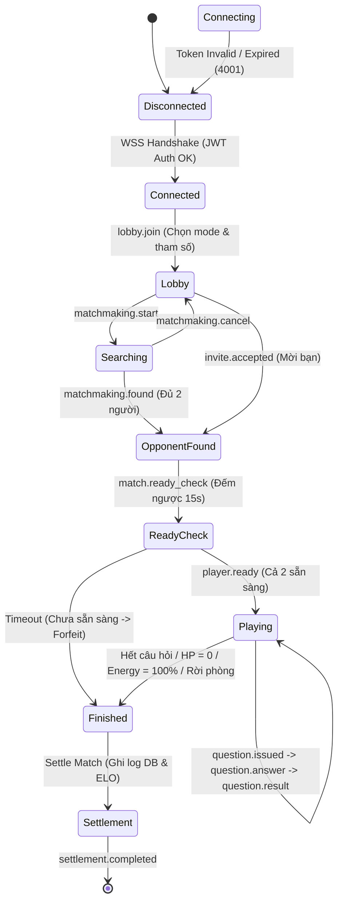
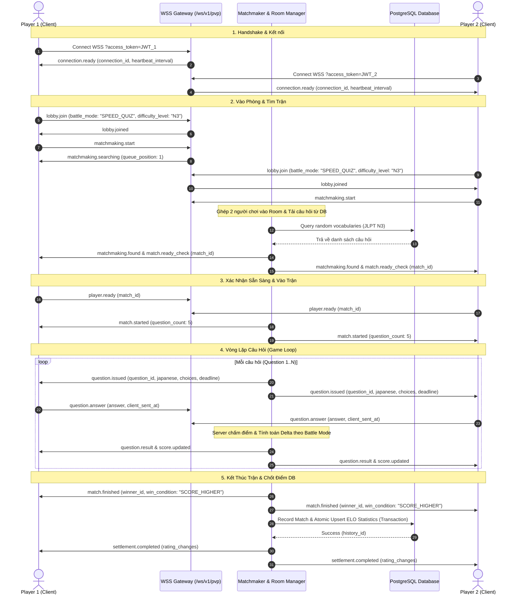

# KujiLingo Backend — Phân Tích Kiến Trúc & Luồng Vận Hành PVP Realtime WebSocket Module

> **Phiên bản:** v2  
> **Endpoint WebSocket:** `WSS /ws/v1/pvp`  
> **Mô hình kiến trúc:** Authoritative Game Server (Server làm chủ hoàn toàn trạng thái trận đấu, điểm số, HP, Năng lượng, đếm giờ và kết quả settlement).

---

## 📋 Mục Lục

1. [Tổng Quan Kiến Trúc](#1-tổng-quan-kiến-trúc)
2. [Cấu Trúc Mã Nguồn & Vai Trò Các File](#2-cấu-trúc-mã-nguồn--vai-trò-các-file)
3. [Sơ Đồ Vòng Đời Trạng Thái (State Diagram)](#3-sơ-đồ-vòng-đời-trạng-thái-state-diagram)
4. [Sơ Đồ Luồng Tuần Tự (Sequence Diagram)](#4-sơ-đồ-luồng-tuần-tự-sequence-diagram)
5. [Phân Tích Chi Tiết 3 Chế Độ Thi Đấu (Battle Modes)](#5-phân-tích-chi-tiết-3-chế-độ-thi-đấu-battle-modes)
6. [Cơ Chế Chốt Kết Quả Tự Động (Internal Settlement Bridge)](#6-cơ-chế-chốt-kết-quả-tự-động-internal-settlement-bridge)
7. [Bảo Mật, Heartbeat & Nối Lại Phiên (Session Resume)](#7-bảo-mật-heartbeat--nối-lại-phiên-session-resume)

---

## 1. Tổng Quan Kiến Trúc

Khác với các REST API thông thường (Stateless Request-Response), hệ thống thi đấu thời gian thực PVP hoạt động theo mô hình **Server-Authoritative Realtime State Machine**:

- **Khách hàng (Client)**: Chỉ chịu trách nhiệm gửi thao tác của người chơi (`lobby.join`, `matchmaking.start`, `player.ready`, `question.answer`) và hiển thị giao diện theo các sự kiện từ Server.
- **Máy chủ (Server)**: Quản lý hàng chờ, ghép cặp, tạo câu hỏi ngẫu nhiên từ DB, tính thời gian đếm ngược từng câu, tự chấm điểm/máu/năng lượng, quyết định người thắng và tự động chốt kết quả ELO vào PostgreSQL.

```text
Client 1 (Player 1) ──┐
                      ├──> [WSS /ws/v1/pvp Gateway] ──> [Session Manager] (JWT Auth, Heartbeat)
Client 2 (Player 2) ──┘           │
                                  ├──> [Matchmaker Manager] (Random Queue & Friend Invites)
                                  │
                                  ├──> [Room Manager Game Engine] (SPEED_QUIZ, HP_BATTLE, ENERGY_BAR)
                                  │         │
                                  │         └──> [Internal Settlement Service]
                                  │                   │
                                  └───────────────────┴──> [PostgreSQL Database]
                                                           (pvp_match_histories, user_pvp_statistics)
```

---

## 2. Cấu Trúc Mã Nguồn & Vai Trò Các File

Toàn bộ module WebSocket nằm trong thư mục `src/websocket/`:

| File | Vai Trò & Chức Năng Chính |
|---|---|
| [`src/websocket/pvp-ws.types.ts`](file:///d:/Kujilingo/KujiLingo_BE/src/websocket/pvp-ws.types.ts) | Định nghĩa toàn bộ Enums (`BattleMode`, `MatchState`), cấu trúc chuẩn `WSBaseMessage`, DTOs Client Commands và Server Events. |
| [`src/websocket/pvp-session.manager.ts`](file:///d:/Kujilingo/KujiLingo_BE/src/websocket/pvp-session.manager.ts) | Xác thực JWT Token (Header/Query/URL), quản lý phiên kết nối (`connection_id`, `session_id`), ngắt session trùng (`DUPLICATE_SESSION`), Ping/Pong Heartbeat 25s và Event Replay Buffer 30s. |
| [`src/websocket/pvp-matchmaker.manager.ts`](file:///d:/Kujilingo/KujiLingo_BE/src/websocket/pvp-matchmaker.manager.ts) | Quản lý thông số phòng thi đấu của người chơi, Hàng chờ ghép ngẫu nhiên (Queue theo mode & JLPT level) và Lời mời thi đấu bạn bè (`invite.send`, `invite.respond`). |
| [`src/websocket/pvp-room.manager.ts`](file:///d:/Kujilingo/KujiLingo_BE/src/websocket/pvp-room.manager.ts) | **Game Engine chính**: Tạo phòng đấu (`PVPRoom`), tải câu hỏi từ DB, phát câu hỏi (`question.issued`), chấm điểm/HP/Energy thời gian thực, xử lý Timer đếm ngược, phân định thắng thua và cầu nối sang Internal Settlement. |
| [`src/websocket/pvp.socket.ts`](file:///d:/Kujilingo/KujiLingo_BE/src/websocket/pvp.socket.ts) | Fastify Route Gateway (`GET /ws/v1/pvp`). Tiếp nhận kết nối, phân loại và điều hướng tất cả lệnh WebSocket từ Client. |
| [`src/websocket/socket.ts`](file:///d:/Kujilingo/KujiLingo_BE/src/websocket/socket.ts) | File entry-point đăng ký các WebSocket routes vào ứng dụng Fastify. |
| [`src/app.ts`](file:///d:/Kujilingo/KujiLingo_BE/src/app.ts) | Đăng ký plugin `@fastify/websocket` và nạp module WebSocket toàn cục. |

---

## 3. Sơ Đồ Vòng Đời Trạng Thái (State Diagram)

Trạng thái thi đấu của một kết nối người chơi qua WebSocket:



---

## 4. Sơ Đồ Luồng Tuần Tự (Sequence Diagram)

Chi tiết truyền nhận thông điệp giữa Player 1, Player 2 và WebSocket Engine:



---

## 5. Phân Tích Chi Tiết 3 Chế Độ Thi Đấu (Battle Modes)

Cả 3 chế độ dùng chung luồng sự kiện `question.issued` ➔ `question.answer` ➔ `question.result`, nhưng logic tính toán con số bên trong Server khác nhau:

### 1️⃣ `SPEED_QUIZ` (Trắc Nghiệm Tốc Độ)
- **Cơ chế**: Điểm cộng cho câu trả lời đúng giảm dần theo thời gian phản hồi.
- **Công thức Server**:
  $$\text{pointsAwarded} = \max\left(10, \lfloor 100 \times (1 - \frac{\text{responseTimeMs}}{\text{timeLimitMs}}) \rfloor\right)$$
- **Điều kiện thắng (`win_condition`)**: Hết toàn bộ câu hỏi, người chơi nào có tổng điểm `score` cao hơn sẽ thắng (`"SCORE_HIGHER"`). Nếu bằng điểm là hòa (`"DRAW"`).

### 2️⃣ `HP_BATTLE` (Đấu Trường Mất Máu)
- **Cơ chế**: Mỗi người chơi bắt đầu với `base_hp` (mặc định 2000 HP).
- **Công thức mất máu**:
  - Trả lời sai hoặc Hết giờ (Timeout): Trừ ngay `500 HP` (`damage_reason: "WRONG_ANSWER"` / `"TIMEOUT"`).
  - Cả 2 cùng đúng nhưng trả lời chậm hơn đối thủ: Trừ máu theo chênh lệch thời gian (`damage_reason: "SLOWER_CORRECT"`):
    $$\text{hpDelta} = -\lfloor 300 \times \frac{\text{responseTime}_{\text{slow}} - \text{responseTime}_{\text{fast}}}{\text{timeLimitMs}} \rfloor$$
- **Điều kiện thắng (`win_condition`)**:
  - **Thắng tức thì**: Người chơi nào bị giảm về `0 HP` trước sẽ thua ngay lập tức (`"HP_ZERO"`).
  - **Hết câu hỏi**: Người chơi nào còn nhiều HP hơn sẽ thắng (`"HP_HIGHER"`).

### 3️⃣ `ENERGY_BAR` (Đua Thanh Năng Lượng)
- **Cơ chế**: Mỗi người bắt đầu với `0%` năng lượng (thang điểm 0 - 100).
- **Công thức cộng năng lượng**:
  - Trả lời đúng: Cộng từ `+15%` đến `+25%` tùy theo tốc độ phản hồi (`energy_delta`).
- **Điều kiện thắng (`win_condition`)**:
  - **Thắng tức thì**: Người chơi nào chạm mốc `100%` Năng lượng trước sẽ thắng ngay lập tức (`"ENERGY_FULL"`).
  - **Hết câu hỏi**: Người chơi nào có % năng lượng cao hơn sẽ thắng (`"ENERGY_HIGHER"`).

---

## 6. Cơ Chế Chốt Kết Quả Tự Động (Internal Settlement Bridge)

Khi trận đấu kết thúc (`match.finished`), **Room Manager Game Engine** tự động gọi hàm Internal Settlement Service mà không cần thông qua HTTP Network Overhead:

```typescript
// Trích đoạn logic tại src/websocket/pvp-room.manager.ts
private async settleMatch(p1: RoomPlayer, p2: RoomPlayer, winnerId: string | null) {
    let ratingChangeUser = winnerId === p1.userId ? 15 : (winnerId === p2.userId ? -15 : 0);
    let ratingChangeOpponent = winnerId === p2.userId ? 15 : (winnerId === p1.userId ? -15 : 0);

    const recordResult = await pvpService.recordMatch({
        user_id: p1.userId,
        opponent_id: p2.userId,
        winner_id: winnerId,
        user_score: p1.score,
        opponent_score: p2.score,
        rating_change_user: ratingChangeUser,
        rating_change_opponent: ratingChangeOpponent,
        played_at: new Date().toISOString(),
        external_match_id: this.matchId, // Đảm bảo tính nguyên tử Idempotent
    });

    this.broadcast({
        type: "settlement.completed",
        event_id: `evt_${uuidv4()}`,
        server_time: new Date().toISOString(),
        data: {
            match_id: this.matchId,
            history_id: recordResult.match_id,
            rating_changes: { [p1.userId]: ratingChangeUser, [p2.userId]: ratingChangeOpponent },
        },
    });
}
```

Nó sẽ chạy một **Prisma Database Transaction** duy nhất:
1. Ghi 1 bản ghi lịch sử vào bảng `pvp_match_histories`.
2. Upsert cập nhật tổng số trận, trận thắng, trận thua, trận hòa, streak và ELO rating hiện tại / cao nhất trong bảng `user_pvp_statistics` cho cả 2 người chơi.

---

## 7. Bảo Mật, Heartbeat & Nối Lại Phiên (Session Resume)

- **Xác thực An toàn (JWT Auth Handshake)**:
  Bóc tách Token 3 lớp (`Header Authorization`, `req.query`, `URL searchParams`). Nếu Token thiếu/hết hạn/sai chữ ký hoặc User bị khóa, ngắt kết nối lập tức với mã `4001 UNAUTHORIZED`.
- **Chống Đăng Nhập Trùng (`DUPLICATE_SESSION`)**:
  Nếu 1 tài khoản mở kết nối WebSocket thứ 2, Server tự động đóng socket cũ kèm thông báo lỗi `DUPLICATE_SESSION`.
- **Giám Sát Kết Nối (Ping/Pong Heartbeat 25s)**:
  Server phát `ping` định kỳ mỗi 25 giây. Nếu quá 2 lượt ping không nhận được `pong` từ client, Server tự động ngắt socket và giải phóng bộ nhớ.
- **Nối Lại Phiên Khi Mạng Chập Chờn (`session.resume`)**:
  Mỗi phiên kết nối duy trì một **Event Replay Buffer** (lưu 50 sự kiện gần nhất). Nếu client bị mất mạng và kết nối lại trong thời gian ân hạn 30 giây với `session_id` và `last_received_event_id`, Server sẽ phát `session.resumed` và phát lại toàn bộ sự kiện đã bỏ lỡ.
