# KIẾN TRÚC XÁC THỰC VÀ BẢO MẬT: TỪ SESSION ID TRUYỀN THỐNG ĐẾN JWT & CHỮ KÝ SỐ BẤT ĐỐI XỨNG RS256

---

## 1. AUTHENTICATION LÀ GÌ? (ĐỊNH DANH & ỦY QUYỀN)

Trong lĩnh vực an toàn thông tin và phát triển ứng dụng, việc kiểm soát truy cập tài nguyên được xây dựng dựa trên hai bức tường phòng thủ độc lập nhưng có mối liên kết chặt chẽ: **Authentication (Xác thực)** và **Authorization (Ủy quyền)**.

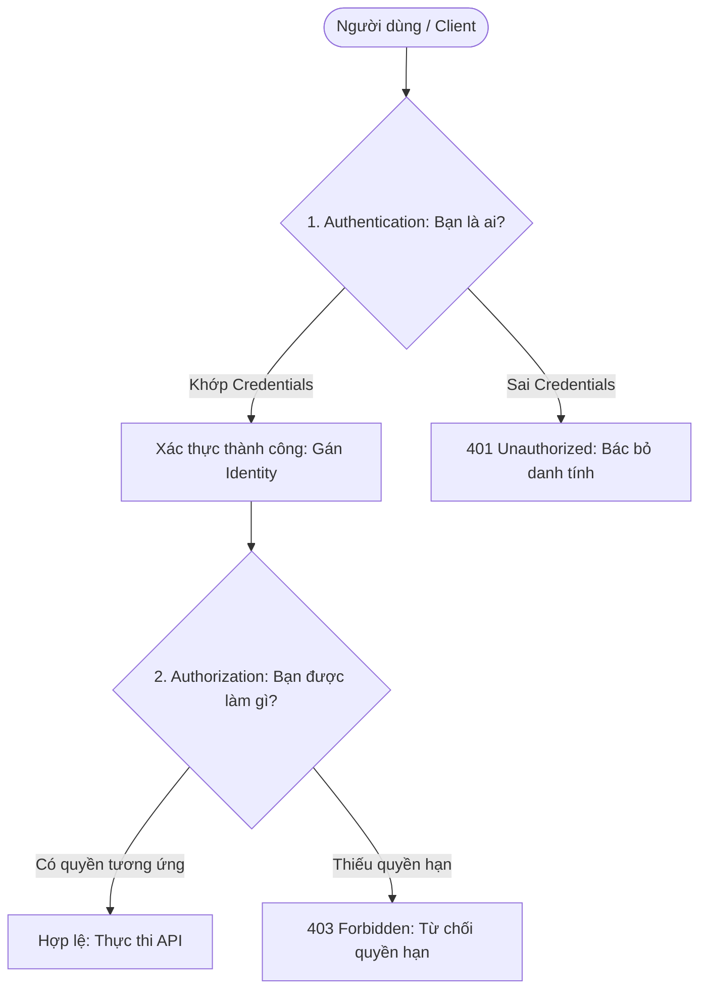

### 1.1. Định nghĩa chi tiết
*   **Authentication (Xác thực - AuthN)**:
    - *Câu hỏi đại diện*: **"Bạn là ai?"**
    - *Định nghĩa*: Là quy trình kỹ thuật nhằm xác minh danh tính tự xưng của một thực thể (người dùng, ứng dụng khách, thiết bị IoT) khi gửi yêu cầu vào hệ thống. Hệ thống sẽ đối khớp các thông tin nhận dạng (Credentials) do thực thể đó cung cấp với cơ sở dữ liệu đã được lưu trữ trước để đưa ra quyết định chấp thuận hay bác bỏ danh tính.
*   **Authorization (Ủy quyền - AuthZ)**:
    - *Câu hỏi đại diện*: **"Bạn được phép làm gì?"**
    - *Định nghĩa*: Là quy trình xác định quyền hạn của một danh tính đã được xác thực (sau khi quá trình AuthN thành công). Hệ thống sẽ kiểm tra xem danh tính đó (đã được định danh dưới một vai trò hoặc quyền hạn cụ thể) có được phép đọc, ghi, sửa đổi hoặc xóa một tài nguyên cụ thể hay không.

### 1.2. Tại sao một ứng dụng Web cần Authentication?
Giao thức HTTP làm nền tảng cho mạng Internet là một giao thức **Stateless (Không trạng thái)**. Nghĩa là, Web Server khi nhận được một Request thứ hai sẽ hoàn toàn không có bất kỳ ký ức nào về Request thứ nhất trước đó, dù cả hai đều gửi từ cùng một trình duyệt của cùng một người dùng. 

Nếu không có Authentication, Server sẽ đối xử với mọi request như nhau. Để bảo vệ dữ liệu cá nhân, phân biệt giữa thông tin của người dùng này với người dùng khác và hạn chế các API nhạy cảm, Server bắt buộc phải có một cơ chế liên tục xác nhận danh tính người dùng qua mỗi Request gửi lên.

### 1.3. Luồng xác thực tổng quát (General Auth Flow)
```text
  [ User ] 
     │ (1) Gửi Credentials (email/password)
     ▼
[ POST /login ] 
     │ (2) Server so khớp CSDL
     ▼
[ Identity Verified ] 
     │ (3) Sinh mã định danh (Session ID hoặc JWT Token)
     ▼
[ Authenticated Token ] ──(4) Gửi ngược lại cho Client lưu trữ
     │
     └─► [ API Request + Token ] ──► [ Protected API ] (5) Server xác thực & xử lý
```

---

## 2. SECURITY VOCABULARY (BẢNG THUẬT NGỮ CHUYÊN SÂU)

Để đảm bảo tính chính xác về mặt kỹ thuật, dưới đây là bảng thuật ngữ bảo mật cốt lõi:

| Thuật ngữ | Định nghĩa | Cơ chế hoạt động | Mục đích | Ví dụ minh họa |
| :--- | :--- | :--- | :--- | :--- |
| **Authentication** | Xác thực danh tính | Đối sánh thông tin đầu vào với dữ liệu gốc của tài khoản. | Xác nhận danh tính người dùng. | Kiểm tra Email và mật khẩu. |
| **Authorization** | Ủy quyền truy cập | So khớp quyền hạn của user với chính sách tài nguyên. | Giới hạn quyền sử dụng chức năng. | Tài khoản thường không được xóa User khác.|
| **Credential** | Thông tin xác thực | Cặp Email/Password, mã OTP, khóa sinh học. | Làm bằng chứng chứng minh danh tính. | Chuỗi password của user nhập từ bàn phím. |
| **Session** | Phiên làm việc | Ghi nhớ trạng thái đăng nhập của client trên server. | Giữ kết nối đăng nhập của người dùng. | Ghi nhận phiên kết nối 30 phút trong DB. |
| **Session ID** | Định danh phiên | Chuỗi ngẫu nhiên duy nhất đại diện cho Session. | Client dùng để tự nhận diện với Server. | Chuỗi UUID `f81d4fae-7dec-11d0-a765`. |
| **Stateful** | Có lưu trạng thái | Server phải ghi nhớ dữ liệu phiên ở phía nó. | Kiểm soát tuyệt đối tính hiệu lực của phiên. | Session ID lưu trong database hoặc Redis. |
| **Stateless** | Không lưu trạng thái | Server không lưu trạng thái phiên của client. | Giảm tải cho DB, dễ dàng scale hệ thống. | JWT Token tự xác thực trong RAM của Server. |
| **JWT** | JSON Web Token | Chuỗi token chuẩn hóa gồm 3 phần Base64. | Truyền tải thông tin an toàn giữa các bên. | Token dài gửi qua HTTP Authorization header.|
| **Header** | Phần đầu JWT | Định nghĩa kiểu token và thuật toán ký. | Cho server biết cách xác thực chữ ký. | `{"alg": "RS256", "typ": "JWT"}`. |
| **Payload** | Phần thân JWT | Chứa thông tin về người dùng (Claims). | Mang dữ liệu định danh dạng dễ đọc. | `{"sub": "123", "role": "admin"}`. |
| **Signature** | Chữ ký số | Mã băm được mã hóa bằng Private Key. | Đảm bảo tính toàn vẹn, chống đổi payload. | Chuỗi mã hóa cuối cùng của Token. |
| **Access Token** | Token truy cập | Token JWT có thời hạn ngắn (15-30 phút). | Dùng gọi các API bảo mật trực tiếp. | Đính kèm `Authorization: Bearer <token>`. |
| **Refresh Token** | Token làm mới | Token ngẫu nhiên có thời hạn dài (30 ngày). | Dùng để xin cấp lại Access Token mới. | Chuỗi token ngẫu nhiên lưu trong Database. |
| **Secret Key** | Khóa bí mật chung | Một chuỗi ký tự bí mật dùng chung. | Dùng cho cả ký và kiểm tra (đối xứng). | Khóa tĩnh `my-super-secret-key-123`. |
| **Private Key** | Khóa riêng tư | Khóa bí mật chỉ có Auth Server nắm giữ. | Dùng để tạo ra Chữ ký số (Signing). | Khóa RSA Private PEM lưu trong hệ thống. |
| **Public Key** | Khóa công khai | Khóa công khai được chia sẻ rộng rãi. | Dùng để xác thực Chữ ký số (Verification).| Khóa RSA Public PEM chia sẻ cho các service.|
| **RSA** | Thuật toán khóa | Thuật toán mã hóa bất đối xứng. | Bảo mật bằng toán học nhân số nguyên tố. | Nền tảng sinh ra Private/Public Key. |
| **RS256** | Thuật toán ký JWT | Chữ ký số RSA kết hợp mã băm SHA-256. | Ký token bất đối xứng an toàn tuyệt đối. | Chuẩn ký mặc định trong hệ thống microservices.|
| **HS256** | Thuật toán ký JWT | Chữ ký số HMAC kết hợp mã băm SHA-256. | Ký token đối xứng nhanh và đơn giản. | Dùng trong kiến trúc đơn giản (Single App).|
| **Hash** | Phép băm một chiều | Chuyển dữ liệu thành chuỗi tĩnh, ko đảo ngược. | Lưu mật khẩu, so khớp dữ liệu. | Chuỗi băm SHA-256 hoặc Bcrypt hash. |
| **Encryption** | Mã hóa hai chiều | Chuyển bản rõ thành bản mã và có thể dịch lại. | Bảo mật thông tin bí mật truyền đi. | Mã hóa dữ liệu bằng AES-256. |
| **Digital Signature** | Chữ ký số | Mã băm dữ liệu mã hóa bằng Private Key. | Xác nhận tính xác thực và không chối bỏ. | Signature ở cuối JWT. |
| **Token Expiration**| Thời gian hết hạn | Thuộc tính định thời hiệu lực của Token. | Giảm thiểu rủi ro nếu token bị lộ. | Trường `exp` trong Payload JWT. |
| **Revoke** | Thu hồi quyền | Vô hiệu hóa token/session trước hạn. | Chặn quyền truy cập khi có sự cố. | Xóa bản ghi Refresh Token trong Database. |
| **Rotation** | Xoay vòng khóa | Thay đổi cặp khóa ký JWT theo chu kỳ. | Giới hạn thiệt hại nếu khóa bị rò rỉ. | Cơ chế định kỳ đổi Private/Public Key. |

---

## 3. STATEFUL SESSION ID AUTHENTICATION (XÁC THỰC LƯU TRẠNG THÁI)

### 3.1. Sơ đồ quy trình hoạt động (Stateful Authentication Flow)

Dưới đây là sơ đồ tuần tự chi tiết mô tả đầy đủ vòng đời của một phiên làm việc sử dụng Session ID:

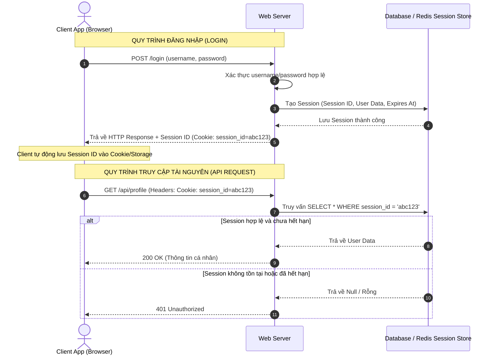

### 3.2. Chi tiết kỹ thuật các thành phần
1.  **Session là gì?**: Là một tập hợp các thông tin về trạng thái làm việc của người dùng hiện tại được lưu giữ và quản lý trên máy chủ.
2.  **Session ID là gì?**: Là một chuỗi ký tự ngẫu nhiên duy nhất (thường sử dụng thuật toán sinh UUIDv4 hoặc các chuỗi cryptographically secure random) được gửi về cho Client để định danh cho Session đó.
3.  **Lưu trữ ở đâu?**:
    - **Server**: Dữ liệu phiên được lưu trong bộ nhớ RAM (Memory Store), Cơ sở dữ liệu quan hệ (PostgreSQL, MySQL), hoặc cơ sở dữ liệu Key-Value tốc độ cao (Redis).
    - **Client**: Trình duyệt hoặc ứng dụng khách thường lưu Session ID trong Cookie (có gắn cờ `HttpOnly` để ngăn Javascript truy cập chống XSS, và `Secure` để bắt buộc truyền qua HTTPS).

---

## 4. SESSION ID HOẠT ĐỘNG NHƯ THẾ NÀO? (MINH HỌA THỰC TẾ)

Hãy xem xét cấu trúc cơ sở dữ liệu mẫu của bảng `sessions` lưu trữ trên máy chủ để hiểu rõ cơ chế truy vấn:

### 4.1. Thiết kế bảng `sessions` trong Database
```sql
CREATE TABLE sessions (
    id VARCHAR(255) PRIMARY KEY,       -- Lưu chuỗi Session ID gửi cho Client
    user_id UUID NOT NULL,             -- Khóa ngoại liên kết tới bảng Users
    user_agent TEXT,                   -- Thiết bị người dùng sử dụng
    ip_address VARCHAR(45),            -- Địa chỉ IP của client
    created_at TIMESTAMP WITH TIME ZONE DEFAULT CURRENT_TIMESTAMP,
    expires_at TIMESTAMP WITH TIME ZONE NOT NULL
);
```

### 4.2. Tiến trình xử lý tại máy chủ
Khi Client gửi một request có kèm Header:
```http
Cookie: session_id=abc123
```

Server sẽ trích xuất giá trị `abc123` và chạy câu lệnh SQL để truy vấn CSDL:
```sql
SELECT * FROM sessions 
WHERE id = 'abc123' 
  AND expires_at > NOW();
```

*   **Trường hợp 1 (Hợp lệ)**: Câu lệnh trả về 1 bản ghi hợp lệ. Server đọc cột `user_id` để biết danh tính người dùng và cho phép truy cập tài nguyên.
*   **Trường hợp 2 (Không tìm thấy / Token giả)**: Câu lệnh trả về rỗng (0 rows) ➡️ Server phản hồi mã lỗi `401 Unauthorized`.
*   **Trường hợp 3 (Đã hết hạn)**: Nếu `expires_at` nhỏ hơn thời điểm hiện tại (`NOW()`), câu lệnh trả về rỗng ➡️ Server phản hồi mã lỗi `401 Unauthorized` và tiến hành xóa bản ghi hết hạn đó khỏi DB để dọn dẹp bộ nhớ.

---

## 5. ƯU NHƯỢC ĐIỂM CỦA SESSION ID & BÀI TOÁN SCALING

### 5.1. Ưu điểm của Session ID
*   **Thu hồi tức thì (Instant Revocation)**: Nếu người dùng báo mất tài khoản, Admin chỉ cần chạy lệnh `DELETE FROM sessions WHERE user_id = '...'` là phiên làm việc của user đó lập tức bị vô hiệu hóa trên toàn thế giới ngay lập tức.
*   **Bảo mật dữ liệu tuyệt đối (Zero Exposure)**: Mọi thông tin nhạy cảm của người dùng (email, vai trò, số dư) đều nằm an toàn trên Server. Token gửi cho Client chỉ là một chuỗi ngẫu nhiên vô nghĩa (`abc123`).

### 5.2. Nhược điểm chí mạng và Bài toán Scale ngang (Horizontal Scaling)

```mermaid
graph TD
    Client1[Client 1] -->|Gửi request kèm session_id=abc123| LB[Load Balancer]
    Client2[Client 2] -->|Gửi request kèm session_id=xyz789| LB
    
    LB -->|Điều phối| ServerA[Server App A <br/> Lưu Session: abc123]
    LB -->|Điều phối| ServerB[Server App B <br/> Lưu Session: xyz789]
    
    style ServerA fill:#d4f1f9,stroke:#00a3e0
    style ServerB fill:#ffe5cc,stroke:#ff8000
    
    Note over LB: Nếu request tiếp theo của Client 1 bị Load Balancer đưa sang Server B,<br/>Server B sẽ bắt Client 1 đăng nhập lại vì RAM của nó không có session 'abc123'!
```

Khi lượng người dùng tăng cao, ta không thể nâng cấp máy chủ mãi (Vertical Scaling) mà phải mở rộng hệ thống bằng cách chạy song song nhiều máy chủ App Server đằng sau một Bộ cân bằng tải (Load Balancer).

*   **Vấn đề phân tán bộ nhớ**: Nếu Session lưu trong bộ nhớ RAM của Server A, khi Load Balancer chuyển request tiếp theo của người dùng sang Server B, Server B sẽ báo lỗi bắt đăng nhập lại vì nó hoàn toàn không biết Session ID này là gì.
*   **Giải pháp Shared Session Store (Dùng Redis/DB chung)**: Để sửa lỗi này, chúng ta buộc phải cài đặt một máy chủ CSDL chuyên dụng để lưu session chung (ví dụ Redis). Tuy nhiên, điều này lại tạo ra:
    - **Độ trễ mạng phụ (Network Latency)**: Mỗi request, App Server đều phải mất thời gian tạo kết nối và gửi lệnh truy vấn mạng sang Redis.
    - **Single Point of Failure (Điểm lỗi duy nhất)**: Nếu máy chủ Redis này gặp sự cố hoặc sập, toàn bộ hệ thống đăng nhập của tất cả App Server sẽ bị tê liệt hoàn toàn.

---

## 6. STATELESS AUTHENTICATION & SỰ RA ĐỜI CỦA JWT

Mô hình **Stateless Authentication (Xác thực không trạng thái)** sử dụng **JWT (JSON Web Token)** ra đời nhằm loại bỏ hoàn toàn các nhược điểm về hiệu năng và bài toán mở rộng hệ thống của Session ID.

```text
Session ID:
    Client mang chìa khóa ("abc123") ──► Server phải đi mở tủ đồ (Database) để lấy dữ liệu.

JWT Token:
    Client mang cả tủ đồ chứa dữ liệu đã được niêm phong bằng chữ ký số ──► Server chỉ cần kiểm tra niêm phong tại chỗ.
```

### Triết lý của Stateless JWT:
Server không cần nhớ gì cả. Tất cả thông tin danh tính của người dùng (ID, Email, Quyền hạn) đều được đóng gói thẳng vào bên trong chuỗi JWT và gửi cho Client tự quản lý. 

Khi Client thực hiện yêu cầu, Server chỉ việc dùng thuật toán giải mã và kiểm tra con dấu chữ ký số đi kèm Token trên RAM. Nếu con dấu hợp lệ, Server lập tức tin tưởng toàn bộ dữ liệu chứa trong Token mà không cần thực hiện bất kỳ câu truy vấn Database nào.

---

## 7. CẤU TRÚC CHI TIẾT CỦA MỘT JWT TOKEN

Một JSON Web Token hợp lệ được biểu diễn dưới dạng một chuỗi ký tự dài, phân tách thành 3 phần bằng 2 dấu chấm `.`:
$$\text{JWT} = \text{Header} \cdot \text{Payload} \cdot \text{Signature}$$

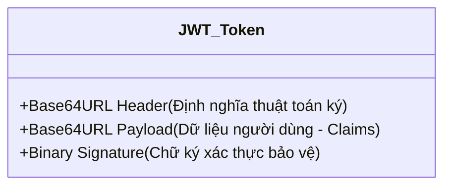

### 7.1. Header (Phần đầu)
Định nghĩa định dạng của Token và thuật toán dùng để sinh chữ ký số.
```json
{
  "alg": "HS256",
  "typ": "JWT"
}
```
*   `alg`: Thuật toán mã hóa ký (ví dụ: `HS256` hoặc `RS256`).
*   `typ`: Loại token (mặc định là `JWT`).

### 7.2. Payload (Phần thân chứa dữ liệu - Claims)
Chứa dữ liệu thông tin người dùng được định nghĩa dưới dạng các "Claims" (lời khẳng định).
```json
{
  "sub": "1234567890",
  "email": "user@example.com",
  "role": "USER",
  "iat": 1700000000,
  "exp": 1700003600
}
```
*   `sub` (Subject): ID định danh người dùng.
*   `email`: Email người dùng.
*   `role`: Phân quyền người dùng.
*   `iat` (Issued At): Thời điểm tạo token (dạng Unix timestamp).
*   `exp` (Expiration Time): Thời điểm token hết hạn.

> [!CAUTION]
> **JWT Payload KHÔNG hề được mã hóa bảo mật.** Nó chỉ được chuyển đổi thành chuỗi text thông qua thuật toán Base64URL để truyền nhận. Bất kỳ ai cũng có thể decode được Payload này. **Do đó, tuyệt đối không được đưa mật khẩu, token ngân hàng, hay các thông tin nhạy cảm vào Payload.**

### 7.3. Signature (Chữ ký số)
Chữ ký số dùng để xác minh tính nguyên vẹn của Token. Nó đảm bảo rằng dữ liệu trong Header và Payload không bị thay đổi trong quá trình gửi đi.

---

## 8. CƠ CHẾ KÝ SỐ VÀ XÁC THỰC CHỮ KÝ SỐ CỦA JWT

### 8.1. Cơ chế Tạo chữ ký (Signing Mechanism)

Chữ ký số được sinh ra bằng cách lấy phần Header mã hóa Base64 và phần Payload mã hóa Base64 nối với nhau bằng dấu chấm `.`, sau đó chạy qua hàm băm kết hợp với chiếc chìa khóa bí mật (Secret/Private Key) của server:

$$\text{Signature} = \text{Algorithm} \Big( \text{Base64}(Header) + "." + \text{Base64}(Payload), \text{Key} \Big)$$

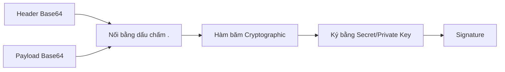

### 8.2. Cơ chế Kiểm tra chữ ký (Verification Mechanism)

Khi nhận được JWT từ phía Client gửi lên, Server tiến hành kiểm chứng:

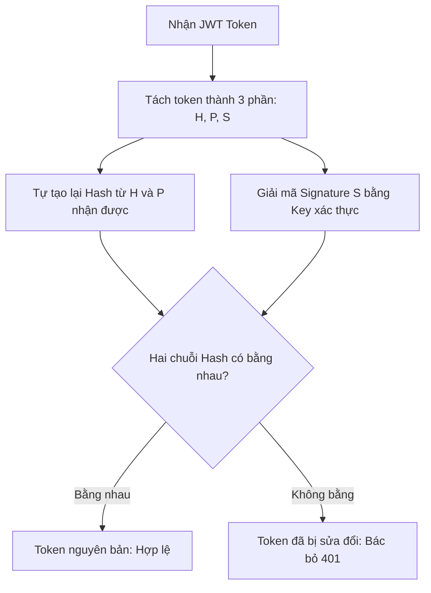

#### Ví dụ thực tế: Tấn công Thay đổi Payload
Hacker lấy trộm được token của mình có quyền `role = USER`. Hacker dùng công cụ giải mã Base64 phần Payload, đổi thành `role = ADMIN` rồi gửi ngược lên Server.

**Server phát hiện như thế nào?**
1.  Hacker đổi Payload ➡️ Phần băm tự tạo lại của Server ($H_{new}$) sẽ bị thay đổi và cho ra một kết quả băm khác hoàn toàn.
2.  Hacker không có chìa khóa bí mật của Server ➡️ Không thể tạo ra một Signature mới khớp với Payload `ADMIN` này.
3.  Server giải mã Signature cũ đi kèm Token ➡️ Thu được chuỗi Hash gốc ($H_{old}$).
4.  Server so sánh thấy $H_{new} \neq H_{old}$ ➡️ **Từ chối token lập tức vì chữ ký không hợp lệ.**

---

## 9. THUẬT TOÁN ĐỐI XỨNG HS256 (HMAC WITH SHA-256)

### 9.1. Khái niệm HS256
HS256 là viết tắt của **HMAC with SHA-256**. Đây là một thuật toán ký đối xứng (Symmetric Cryptography), nghĩa là **Chỉ sử dụng duy nhất một Khóa bí mật (Secret Key)** cho cả hai việc: ký tạo ra token và giải mã để verify token.

$$\text{Tạo Signature} \xrightarrow{\quad \mathbf{\text{JWT\_SECRET}} \quad} \text{Xác thực Signature}$$

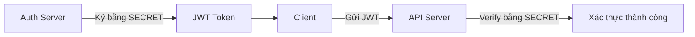

### 9.2. Quy trình hoạt động
*   Khi user đăng nhập thành công, Server lấy một chuỗi khóa bí mật (ví dụ: `JWT_SECRET = "kujilingo_secret_123"`) để ký và sinh ra JWT gửi cho client.
*   Khi client gửi yêu cầu lên, Server lại dùng chính chuỗi `JWT_SECRET = "kujilingo_secret_123"` đó để verify chữ ký số.

---

## 10. VẤN ĐỀ CỦA HS256 TRONG HỆ THỐNG PHÂN TÁN (TRUST BOUNDARY)

> [!IMPORTANT]
> HS256 tự bản thân nó là một thuật toán mật mã học **an toàn và mạnh mẽ**. Vấn đề của HS256 không nằm ở thuật toán, mà nằm ở **Bài toán phân phối khóa (Key Distribution)** và **Ranh giới tin cậy (Trust Boundary)** trong các hệ thống phân tán hoặc nhiều microservices.

### Kịch bản sụp đổ bảo mật của HS256:

Giả sử ứng dụng của bạn phát triển lớn mạnh và tách thành 4 dịch vụ (Microservices):
1.  **Auth Service**: Chịu trách nhiệm Login/Register và ký cấp token.
2.  **Payment Service**: Chịu trách nhiệm nạp tiền, giao dịch VIP.
3.  **Course Service**: Quản lý các bài học.
4.  **Chat Service**: Dịch vụ chat phòng cộng đồng.

```mermaid
graph TD
    Auth[Auth Service: Giữ SECRET] -->|Cấp JWT| User([Người dùng])
    User -->|Gọi API| Chat[Chat Service: Cần lưu SECRET để verify]
    User -->|Gọi API| Pay[Payment Service: Cần lưu SECRET để verify]
    style Chat fill:#ffcccc,stroke:#ff3333,stroke-width:2px
    Note over Chat: Nếu Chat Service có lỗ hổng bảo mật,<br/>hacker chiếm quyền và lấy được SECRET KEY!<br/>Hacker có thể tự sinh JWT giả mạo Admin để hack Payment Service.
```

*   **Vấn đề**: Cả 4 dịch vụ này đều cần phải kiểm tra xem Token của user gửi lên có hợp lệ không. Vì HS256 dùng chung 1 khóa, bạn bắt buộc phải copy chuỗi `JWT_SECRET` đó và cấu hình vào mã nguồn/máy chủ của **cả 4 dịch vụ**.
*   **Hậu quả**: Nếu máy chủ **Chat Service** (thường có tính bảo mật thấp hơn) bị hacker tấn công chiếm quyền điều khiển và lấy cắp được `JWT_SECRET` ➡️ Hacker lúc này có thể dùng chính Secret Key đó để tự ký ra một Token có quyền `ADMIN` rồi gửi thẳng lệnh rút tiền sang **Payment Service**. Hệ thống Payment hoàn toàn tin tưởng Token này vì chữ ký hoàn toàn chính xác. 
*   Ranh giới bảo mật của toàn bộ các dịch vụ độc lập bị sụp đổ hoàn toàn chỉ vì một điểm yếu duy nhất.

---

## 11. MẬT MÃ BẤT ĐỐI XỨNG & SỰ ĐỔI MỚI CỦA RSA

Mật mã bất đối xứng (Asymmetric Cryptography) ra đời để giải quyết triệt để bài toán phân phối khóa bằng cách sử dụng **Cặp khóa chuyên biệt**.

```text
Khóa đối xứng (HS256):
    Dùng chung 1 chìa khóa bí mật cho cả việc Đóng hòm (Ký) và Mở hòm (Verify).

Khóa bất đối xứng (RSA/RS256):
    - Private Key: Chỉ dùng để Đóng hòm (Ký) -> Phải giữ bí mật tuyệt đối.
    - Public Key: Chỉ dùng để Mở hòm (Verify) -> Chia sẻ thoải mái cho mọi người.
```

### 11.1. Vai trò của hai loại khóa
*   **Private Key (Khóa riêng tư)**: 
    - Chỉ được giữ và bảo vệ nghiêm ngặt tại **Auth Server** (nơi trực tiếp xử lý login).
    - Nhiệm vụ duy nhất: Dùng để **ký tạo ra chữ ký số** trên JWT.
*   **Public Key (Khóa công khai)**:
    - Có thể chia sẻ rộng rãi, công khai cho bất kỳ ai, bất kỳ service vệ tinh nào.
    - Nhiệm vụ duy nhất: Dùng để **kiểm tra và xác thực** xem chữ ký số có phải do Private Key tương ứng tạo ra không.
    - **Quan trọng**: Public Key **hoàn toàn không có khả năng ký hay tạo ra chữ ký mới**.

---

## 12. THUẬT TOÁN RSA TRÊN PHƯƠNG DIỆN KHÁI NIỆM

### 12.1. RSA là gì?
RSA (viết tắt của ba nhà khoa học Rivest, Shamir và Adleman) là một thuật toán mật mã học bất đối xứng đặt nền móng cho bảo mật internet hiện đại. 

### 12.2. Mối quan hệ toán học giữa hai khóa
Hai khóa Private Key và Public Key được tạo ra đồng thời từ một cặp số nguyên tố cực lớn. Chúng có mối quan hệ toán học chặt chẽ:
*   Mọi thông tin được mã hóa bằng **Private Key** chỉ có thể giải mã thành công bằng **Public Key**.
*   Không thể tính toán hay suy ngược ra cấu trúc của Private Key từ Public Key bằng các phương pháp máy tính thông thường (đòi hỏi thời gian tính toán hàng tỷ năm).

---

## 13. THUẬT TOÁN KÝ SỐ RS256 (RSA SIGNATURE WITH SHA-256)

RS256 là sự kết hợp giữa thuật toán khóa bất đối xứng RSA và thuật toán băm SHA-256 để ký số JWT.

### 13.1. Quy trình ký số (Signing Flow)

$$\text{Signature} = \text{Encrypt}_{\text{Private Key}} \Big( \text{SHA-256} \big( \text{Header} + "." + \text{Payload} \big) \Big)$$

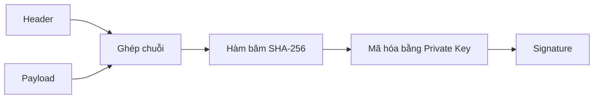

### 13.2. Quy trình xác thực chữ ký số (Verification Flow)

$$\text{SHA-256}(Header + Payload) \stackrel{?}{=} \text{Decrypt}_{\text{Public Key}}(Signature)$$

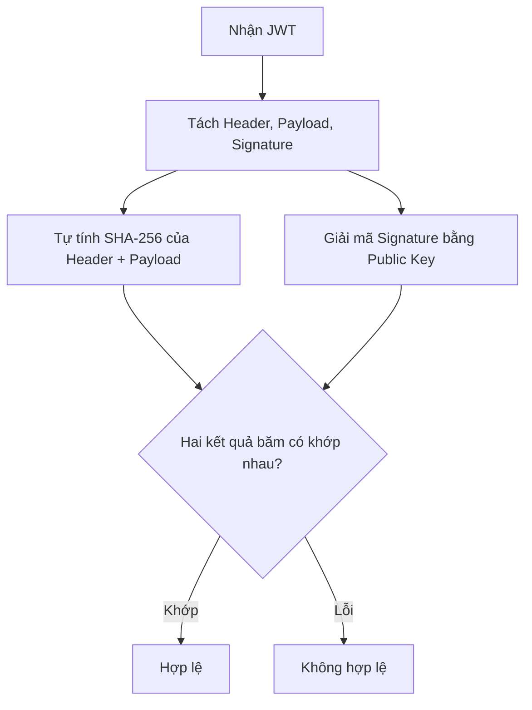

---

## 14. SO SÁNH TRỰC DIỆN: HS256 VS RS256

Dưới đây là bảng so sánh chi tiết giữa hai thuật toán ký JWT phổ biến nhất:

| Tiêu chí so sánh | HS256 | RS256 |
| :--- | :--- | :--- |
| **Dạng mật mã** | Đối xứng (Symmetric). | Bất đối xứng (Asymmetric). |
| **Khóa dùng để ký** | Secret Key (Bí mật). | Private Key (Bí mật). |
| **Khóa dùng để verify**| Dùng chính Secret Key đó. | Public Key (Công khai). |
| **Phân phối khóa** | Khó khăn và nguy hiểm (Mọi service đều cần giữ Secret Key). | Dễ dàng và an toàn (Chỉ cần chia sẻ Public Key công khai). |
| **Độ an toàn khi scale**| Thấp (Một service bị lộ ➡️ Cả hệ thống bị xâm nhập). | Cao (Lộ Public Key ở service vệ tinh không gây ảnh hưởng). |
| **Hiệu năng CPU** | Nhanh hơn (Phép toán băm đối xứng tiêu tốn ít CPU). | Chậm hơn (Phép toán giải mã bất đối xứng phức tạp hơn). |
| **Trường hợp áp dụng** | Ứng dụng đơn lẻ (Monolith), các kết nối nội bộ tin cậy cao. | Hệ thống phân tán, Microservices, tích hợp bên thứ ba (OAuth). |

*Giải thích chi tiết*:
*   **Key sharing**: Với HS256, việc truyền khóa Secret Key qua các phòng ban hoặc cấu hình lên nhiều máy chủ làm tăng khả năng bị lộ. Với RS256, bạn có thể đưa Public Key lên một đường link HTTP công khai cho mọi người tải về verify mà không sợ mất bảo mật.
*   **Performance**: HS256 nhanh hơn RS256 khoảng vài lần về tốc độ xử lý toán học trên CPU. Tuy nhiên, trong ứng dụng web thông thường, sự chênh lệch này là siêu nhỏ (cấp độ micro giây) nên RS256 vẫn là lựa chọn hàng đầu nhờ tính bảo mật vượt trội.

---

## 15. TẠI SAO RS256 PHÙ HỢP HOÀN HẢO CHO KIẾN TRÚC VỆ TINH?

Hãy phân tích sơ đồ kiến trúc phân tách ranh giới tin cậy (Trust Boundary) dưới đây:

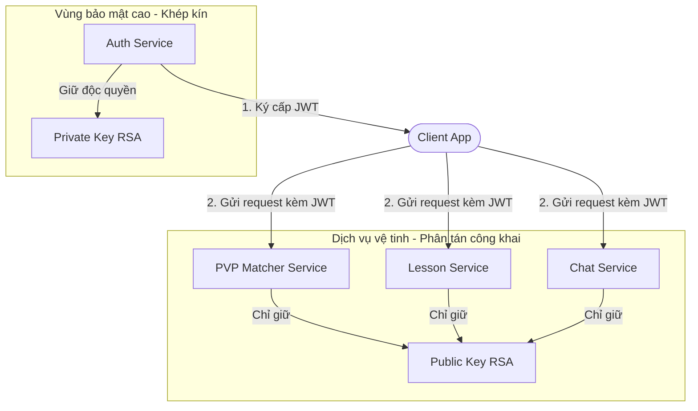

### Cơ chế bảo vệ:
1.  **Phân tách đặc quyền (Privilege Separation)**: Chỉ duy nhất **Auth Service** nằm trong vùng bảo mật cao có quyền ký phát hành Token. Các service khác chỉ đóng vai trò là "Người xác thực" (Verifiers).
2.  **Thiết lập ranh giới tin cậy (Trust Boundary)**:
    - Nếu **Chat Service** bị hacker xâm nhập thành công ➡️ Hacker chỉ lấy được `Public Key`.
    - Hacker dùng Public Key này không thể nào tự ký ra một Token mới với vai trò Admin để truy cập vào **Payment Service**.
    - **Hệ thống được bảo vệ vững chắc**: Lỗ hổng bảo mật của một dịch vụ vệ tinh không thể lây lan và làm sụp đổ toàn bộ hạ tầng bảo mật của hệ thống.

---

## 16. JWT KHÔNG PHẢI LÀ ENCRYPTION (MÃ HÓA)

Một trong những sai lầm phổ biến nhất của các lập trình viên là nhầm lẫn các khái niệm xử lý dữ liệu.

### 16.1. Phân biệt các khái niệm

| Khái niệm | Định nghĩa | Có cần khóa không? | Có thể khôi phục? | Mục đích chính |
| :--- | :--- | :--- | :--- | :--- |
| **Encoding** | Chuyển đổi định dạng dữ liệu (ví dụ: Base64). | Không. | Có (Ai cũng làm được). | Giúp truyền tải dữ liệu an toàn trên mạng không lỗi font. |
| **Hashing** | Băm một chiều dữ liệu thành chuỗi cố định. | Không. | Không (Một chiều). | So khớp dữ liệu nhanh, lưu mật khẩu không dịch ngược. |
| **Encryption**| Mã hóa dữ liệu dạng rõ thành dạng mờ. | Có. | Có (Nếu có khóa). | Bảo vệ tính bí mật của dữ liệu truyền đi. |
| **Signing** | Ký số để chứng minh nguồn gốc dữ liệu. | Có (Private Key). | Không cần thiết. | Chứng minh dữ liệu không bị chỉnh sửa và đúng nguồn gốc. |

### 16.2. Những dữ liệu tuyệt đối không đặt vào JWT Payload:
*   Mật khẩu rõ (Plaintext Password) hoặc Mật khẩu đã băm (Password Hash).
*   Mã số thẻ tín dụng, thông tin tài chính cá nhân.
*   Token truy cập của bên thứ ba (như Gmail Refresh Token).

---

## 17. XÁC THỰC KHÔNG TRẠNG THÁI (STATELESS) VỚI JWT HOẠT ĐỘNG THẾ NÀO?

Hãy so sánh trực quan cơ chế xác thực để thấy sự khác biệt về luồng xử lý:

### 17.1. Sơ đồ Stateful Session (Truy vấn liên tục)
```text
Client ──► [Request API] ──► Server ──► [SELECT FROM sessions] ──► DB ──► Trả về User
```

### 17.2. Sơ đồ Stateless JWT (Xác thực tại chỗ)
```text
Client ──► [Request API] ──► Server ──► [Giải mã Signature trên RAM] ──► Trả về User
                                        (Không cần truy vấn Database)
```

Do token đã tự chứa đầy đủ các thông tin Claims cần thiết (`sub`, `role`) và được niêm phong bằng chữ ký số, Server App chỉ cần dùng CPU để giải mã và verify. Việc này giúp hệ thống của bạn loại bỏ hoàn toàn các truy vấn xác thực xuống CSDL, giải quyết triệt để nút thắt cổ chai về I/O mạng.

---

## 18. JWT ACCESS TOKEN (THẺ TRUY CẬP NGẮN HẠN)

Access Token là chiếc thẻ thông hành chính dùng để xác thực quyền truy cập qua từng API request.

### 18.1. Các Claims tiêu chuẩn trong Access Token
*   `sub` (Subject): ID của người dùng sở hữu token.
*   `role`: Quyền hạn của người dùng trong hệ thống (để phân quyền ở Middleware).
*   `exp` (Expiration Time): Thời điểm hết hạn của token.
*   `iat` (Issued At): Thời điểm phát hành token.

### 18.2. Tại sao Access Token nên có thời gian sống ngắn (Short-lived)?
Bởi vì Access Token hoạt động Stateless, server không thể chặn đứng nó một cách đơn giản nếu nó bị lộ. Việc thiết lập thời gian sống ngắn (ví dụ: 15 phút) đảm bảo:
*   Nếu hacker trộm được Token này, chúng chỉ có tối đa 15 phút để phá hoại.
*   Hệ thống tự động cô lập và vô hiệu hóa Token đó mà không cần bất kỳ thao tác thủ công nào từ quản trị viên.

---

## 19. REFRESH TOKEN (THỦ THƯ CẤP PHÁT PHIÊN ĐĂNG NHẬP)

Để giải quyết vấn đề trải nghiệm người dùng (bắt người dùng đăng nhập lại sau mỗi 15 phút), chúng ta bổ sung **Refresh Token**.

```text
Access Token (15 phút - Stateless):
    Trình ra cho nhân viên kiểm tra để vào cửa học bài (Xử lý cực nhanh).

Refresh Token (30 ngày - Stateful):
    Chỉ trình ra khi thẻ vào cửa (Access Token) hết hạn để đổi lấy thẻ mới.
```

### Đặc tính kỹ thuật của Refresh Token:
*   Được lưu trữ an toàn dưới Database (bảng `refresh_tokens`).
*   Có thời hạn dài (30 ngày).
*   Mỗi lần được gửi lên để xin Access Token mới, Server sẽ thực hiện truy vấn Database để kiểm tra xem Token này có bị thu hồi hay không. Do tần suất xin cấp lại Access Token rất thấp (15 phút một lần), việc truy vấn DB này hoàn toàn không gây ảnh hưởng đến hiệu năng hệ thống.

---

## 20. VẤN ĐỀ THU HỒI (REVOCATION PROBLEM) CỦA JWT

Điểm yếu lớn nhất của kiến trúc Stateless JWT là **Bất khả thu hồi trước hạn (Hard to Revoke)**.

### 20.1. Bản chất vấn đề
Khi một JWT Access Token có hạn 30 ngày được ký và gửi đi, Server không lưu trữ trạng thái của nó. Nếu người dùng nhấn nút "Đăng xuất" hoặc Admin khóa tài khoản:
*   Server không có chỗ nào để xóa hay đánh dấu Token này là "vô hiệu".
*   Hacker có được Token này vẫn có thể gửi lên các API bình thường và Server vẫn chấp nhận nó vì chữ ký toán học vẫn hoàn toàn hợp lệ!

### 20.2. Các chiến lược giải quyết vấn đề Thu hồi JWT:

```mermaid
graph TD
    Revoke[Chiến lược Thu hồi JWT] --> Strategy1[1. Access Token ngắn hạn + Refresh Token]
    Revoke --> Strategy2[2. Token Blacklist / Blocklist]
    Revoke --> Strategy3[3. JWT Versioning]
    
    Note over Strategy1: KujiLingo áp dụng chiến lược này (Hybrid)<br/>để giữ cân bằng hiệu năng và bảo mật tốt nhất.
```

1.  **Chiến lược Access Token ngắn hạn + Refresh Token (KujiLingo đang dùng)**:
    - Rút ngắn thời gian Access Token xuống còn 15 phút.
    - Chấp nhận rủi ro tối đa 15 phút nếu bị lộ Access Token. Khi người dùng đăng xuất, ta xóa Refresh Token trong Database. Sau tối đa 15 phút, Access Token hết hạn và kẻ gian không thể làm mới được nữa.
2.  **Chiến lược Token Blacklist (Danh sách đen)**:
    - Khi người dùng đăng xuất, lưu chuỗi Access Token bị hủy vào một cache tốc độ cao (như Redis) kèm theo thời gian hết hạn còn lại của nó.
    - Mỗi khi nhận request, server check xem token có nằm trong Blacklist không.
    - *Nhược điểm*: Phá vỡ tính chất hoàn toàn Stateless của JWT và làm phình to bộ nhớ RAM của Redis.
3.  **Chiến lược JWT Versioning (Phiên bản Token)**:
    - Lưu một cột `token_version` (Integer) trong bảng `users` (ví dụ mặc định là `1`).
    - Gắn `token_version: 1` vào Payload của JWT.
    - Khi đổi mật khẩu hoặc cần logout mọi thiết bị, tăng `token_version` trong DB lên `2`.
    - Khi verify token, Middleware so khớp version trong token (`1`) với version trong DB (`2`), nếu lệch ➡️ Từ chối token.
    - *Nhược điểm*: Mỗi request lại phải truy vấn CSDL để lấy `token_version` của User ➡️ Trở thành mô hình Stateful.

---

## 21. KIẾN TRÚC LAI HYBRID AUTHENTICATION

Kiến trúc lai Hybrid là giải pháp tối ưu nhất cho các ứng dụng thực tế bằng cách phân phối tài nguyên hợp lý:

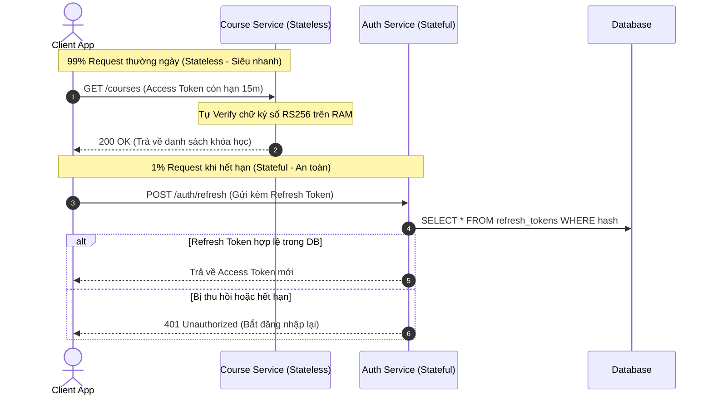

### Sự tối ưu của mô hình Hybrid:
*   **Hiệu năng**: Các thao tác học tập, PVP tương tác cao chạy 100% Stateless giúp tăng tốc hệ thống.
*   **Kiểm soát**: Thao tác nhạy cảm liên quan đến phiên (Refresh/Logout) chạy Stateful giúp kiểm soát an ninh chặt chẽ.

---

## 22. SECURITY ATTACK SCENARIOS & MITIGATION (KỊCH BẢN TẤN CÔNG & PHÒNG THỦ)

### Attack 1: Token Modification (Sửa đổi Payload)
*   *Kịch bản*: Hacker sửa vai trò từ `role = USER` thành `role = ADMIN` trong token của mình.
*   *Phòng thủ*: Chữ ký số RS256 bảo vệ. Server giải mã chữ ký bằng Public Key và đối chiếu băm. Do hacker không có Private Key để tạo chữ ký tương ứng với payload mới ➡️ Xác thực thất bại ở Middleware.

### Attack 2: Token Theft (Đánh cắp Access Token)
*   *Kịch bản*: Hacker dùng phần mềm sniffer lấy cắp Access Token trên đường truyền mạng.
*   *Phòng thủ*: Access Token hết hạn sau 15 phút. Hacker chỉ có thể phá hoại trong thời gian ngắn ngủi này và không thể gia hạn thêm vì không có Refresh Token.

### Attack 3: Secret Key Leakage (HS256)
*   *Kịch bản*: Hacker chiếm quyền điều khiển server PVP phụ và lấy được file cấu hình có chứa `JWT_SECRET`.
*   *Phòng thủ*: (Nếu dùng HS256) Hacker dùng Secret này để tự tạo token Admin xâm nhập vào Payment Server. Để phòng thủ, hệ thống **không sử dụng HS256** mà dùng **RS256** (chỉ lưu Public Key ở server PVP).

### Attack 4: Private Key Leakage (RS256)
*   *Kịch bản*: Server Auth bị hack toàn diện và mất Private Key.
*   *Phòng thủ*: Hacker có quyền sinh token giả mạo toàn hệ thống. Cách phòng thủ duy nhất là lập tức cấu hình lại `JWT_PRIVATE_KEY` mới trong env, xóa toàn bộ session cũ và thông báo Public Key mới cho các service.

### Attack 5: Refresh Token Theft (Đánh cắp Refresh Token)
*   *Kịch bản*: Hacker lấy cắp được Refresh Token lưu ở Client.
*   *Phòng thủ*: Khi người dùng phát hiện, họ nhấn Đăng xuất. Server lập tức xóa/hủy dòng Refresh Token đó trong Database. Khi hacker gửi token đó lên để refresh sẽ bị từ chối do không tìm thấy trong DB.

### Attack 6: Replay Attack (Tấn công gửi lại)
*   *Kịch bản*: Hacker bắt các gói tin xác thực cũ và gửi lại y hệt lên Server để đòi quyền truy cập.
*   *Phòng thủ*: Sử dụng thời gian hết hạn (`exp`), kiểm tra tính duy nhất của mã băm token, kết hợp với bắt buộc sử dụng giao thức HTTPS để mã hóa đường truyền.

---

## 23. BẢNG SO SÁNH TOÀN DIỆN CÁC KIẾN TRÚC

| Tiêu chí | Session ID (Stateful) | JWT HS256 (Stateless) | JWT RS256 (Stateless) | KujiLingo Hybrid (RS256) |
| :--- | :--- | :--- | :--- | :--- |
| **State lưu tại Server** | Có (Lưu toàn bộ phiên). | Không lưu gì. | Không lưu gì. | Chỉ lưu Refresh Token. |
| **Xác thực request** | DB/Redis Lookup. | Verify mật mã (RAM). | Verify mật mã (RAM). | Verify mật mã (RAM). |
| **Tốc độ xử lý** | Chậm hơn (vướng I/O DB). | Rất nhanh. | Rất nhanh. | Rất nhanh. |
| **Dễ mở rộng (Scale)** | Khó (Cần Shared Store).| Rất dễ. | Rất dễ. | Rất dễ. |
| **Khả năng Revoke** | Lập tức. | Không thể trước hạn. | Không thể trước hạn. | Tối đa 15 phút. |
| **Quản lý khóa** | Không cần khóa. | Phức tạp (Lộ là mất). | An toàn (Chia sẻ Public Key). | An toàn (Chia sẻ Public Key). |
| **Ứng dụng Microservices**| Kém. | Kém (Nguy cơ lộ key). | Rất tốt. | Xuất sắc. |

---

## 24. KHI NÀO NÊN DÙNG KIẾN TRÚC NÀO? (USE CASES THỰC TẾ)

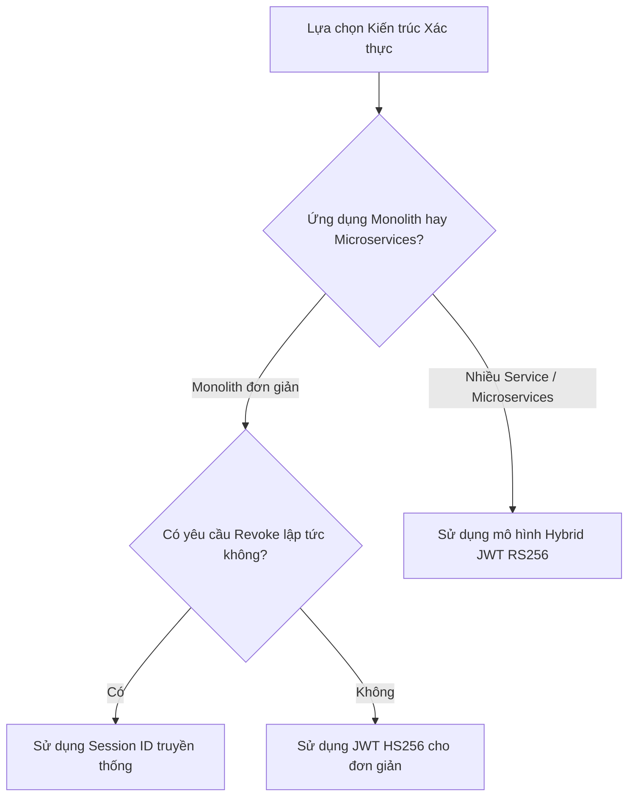

### 24.1. Chọn Session ID khi:
*   Ứng dụng dạng Server-Side Rendering truyền thống (như Laravel, Spring Boot, Django) chạy trên một Monolith Server duy nhất.
*   Các ứng dụng tài chính cần kiểm soát phiên đăng nhập chặt chẽ từng giây (như Internet Banking, chứng khoán).

### 24.2. Chọn JWT HS256 khi:
*   Ứng dụng SPA (React/Vue) kết nối tới duy nhất một Backend Server tin cậy.
*   Dự án nhỏ, cần triển khai nhanh và không có hạ tầng quản lý cặp khóa phức tạp.

### 24.3. Chọn JWT RS256 khi:
*   Hệ thống phân tán, có nhiều Microservices độc lập cần xác thực Token của người dùng.
*   Xây dựng hệ thống Đăng nhập đơn nhất (SSO - Single Sign-On) hoặc làm Identity Provider cấp quyền cho bên thứ ba (như Google, Facebook OAuth).

---

## 25. PHÂN TÍCH CHUYÊN SÂU VỀ HIỆU NĂNG TÍNH TOÁN

*   **Session (Stateful)**: Tiêu hao tài nguyên I/O của mạng và ổ đĩa cứng (hoặc RAM của Redis). Thao tác đọc/ghi DB thường mất khoảng $2\text{ms} - 20\text{ms}$.
*   **JWT (RS256 - Stateless)**: Tiêu hao tài nguyên xử lý toán học của CPU (để giải mã RSA). Thao tác tính toán trên RAM này chỉ mất khoảng $0.05\text{ms} - 0.2\text{ms}$.
*   **Tối ưu Hybrid**: Giúp giảm thiểu tối đa tổng thời gian xử lý của hệ thống bằng cách dồn toàn bộ việc verify thông thường vào RAM của CPU, chỉ dành I/O Database cho các thao tác làm mới phiên (Refresh) vốn có tần suất cực thấp.

---

## 26. QUẢN LÝ KHÓA AN TOÀN (KEY MANAGEMENT BEST PRACTICES)

Cặp khóa RSA của bạn chính là "Chìa khóa vạn năng" bảo vệ toàn bộ vương quốc. Do đó, cần tuân thủ nghiêm ngặt các quy tắc quản lý khóa sau:

1.  **Tuyệt đối không commit khóa lên Git**: Không bao giờ được lưu Private Key trực tiếp vào mã nguồn dự án. Phải nạp qua biến môi trường (`process.env`) được cấu hình trực tiếp trên máy chủ Production hoặc dùng các dịch vụ quản lý bí mật (như AWS Secrets Manager, HashiCorp Vault).
2.  **Mã hóa Base64 để lưu trữ**: Khóa RSA PEM có nhiều dòng rất dễ bị lỗi định dạng khi lưu trong file `.env`. Mã hóa Base64 toàn bộ khóa thành 1 dòng duy nhất giúp việc cấu hình trở nên an toàn và sạch sẽ.
3.  **Xoay vòng khóa (Key Rotation)**: Cần thiết lập quy trình thay đổi cặp khóa định kỳ (ví dụ mỗi 90 ngày) để hạn chế rủi ro nếu có một cặp khóa cũ nào đó bị rò rỉ mà hệ thống chưa phát hiện ra.

---

## 27. BA SƠ ĐỒ KIẾN TRÚC MẪU (ARCHITECTURE COMPARISON DIAGRAMS)

### 27.1. Mô hình Session ID truyền thống
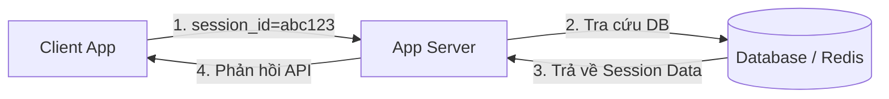

### 27.2. Mô hình JWT HS256
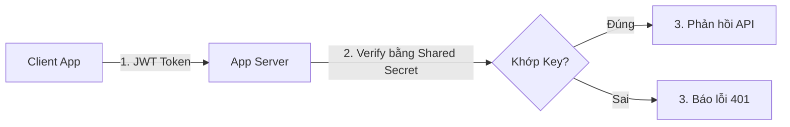

### 27.3. Mô hình JWT RS256 (Bất đối xứng)
```mermaid
graph LR
    Client[Client App] -->|1. JWT Token| Server[App Server Vệ tinh]
    Server -->|2. Verify bằng Public Key| Ver{Khớp Chữ Ký?}
    Ver -- Đúng --> Success[3. Phản hồi API]
    Ver -- Sai --> Fail[3. Báo lỗi 401]
    Note over Server: Server không có và không cần biết Private Key!
```

---

## 28. BỨC TRANH TOÀN CẢNH (THE BIG PICTURE)

Sơ đồ cây dưới đây thể hiện sự phân nhánh toàn bộ kiến thức về cấu trúc hệ thống xác thực:

```text
Authentication (Xác thực danh tính)
│
├── Stateful (Lưu trạng thái trên Server)
│   └── Session ID (Lưu Session trong DB/RAM, gửi Cookie Session ID cho client)
│
└── Stateless (Tự chứa thông tin định danh, Server không cần lưu)
    └── JWT (JSON Web Token)
        │
        ├── HS256 (Thuật toán ký đối xứng - Dùng chung 1 Secret Key)
        │   └── Thích hợp hệ thống Monolith nhỏ, bảo mật trung bình
        │
        └── RS256 (Thuật toán ký bất đối xứng - Dùng Private/Public Key)
            ├── Private Key (Chỉ lưu ở Auth Server, dùng để KÝ token)
            └── Public Key (Chia sẻ cho các Service vệ tinh, dùng để VERIFY token)
```

---

## 29. NHỮNG HIỂU LẦM THƯỜNG GẶP (15 MISCONCEPTIONS)

### 1. JWT là mã hóa dữ liệu (JWT is Encryption)
*   *Sai*: JWT mặc định không mã hóa payload.
*   *Đúng*: Payload chỉ được mã hóa Base64URL để truyền nhận. Bất kỳ ai cũng có thể decode được dễ dàng. Nó chỉ được **bảo vệ tính toàn vẹn bằng chữ ký số** chứ không được bảo mật nội dung.

### 2. JWT luôn luôn tốt và an toàn hơn Session ID
*   *Sai*: JWT khó thu hồi và dễ bị lộ nếu lưu ở client không an toàn.
*   *Đúng*: Mỗi công nghệ có ưu nhược điểm riêng. Session tốt cho bảo mật thu hồi tức thì, JWT tốt cho hiệu năng và mở rộng hệ thống lớn.

### 3. Thuật toán RS256 luôn luôn bảo mật hơn HS256
*   *Sai*: Cả hai đều an toàn tuyệt đối về mặt mật mã học.
*   *Đúng*: Sự khác biệt nằm ở cơ chế quản lý khóa (Symmetric vs Asymmetric). RS256 an toàn hơn trong kiến trúc Microservices vì nó loại bỏ được rủi ro chia sẻ chung Secret Key.

### 4. Public Key là thông tin mật, phải giữ kín
*   *Sai*: Phải giấu Public Key.
*   *Đúng*: Public Key có thể công khai cho tất cả mọi người cùng biết. Bản chất của mật mã bất đối xứng là Public Key chỉ dùng để verify chứ không thể dùng để ký giả mạo.

### 5. Payload JWT có thể lưu trữ mật khẩu đã băm (Password Hash)
*   *Sai*: Cứ đưa vào vì đã có chữ ký bảo vệ.
*   *Đúng*: Tuyệt đối không đưa. Kẻ gian có thể đọc được password hash và dùng các phương pháp dò tìm offline để tìm ra mật khẩu gốc của người dùng.

### 6. Khi người dùng nhấn nút Logout, JWT đó lập tức bị vô hiệu hóa
*   *Sai*: Server Stateless nhận diện được logout.
*   *Đúng*: Trong mô hình thuần Stateless, JWT vẫn hoàn toàn hợp lệ cho đến khi nó tự hết hạn (`exp`), trừ khi bạn áp dụng cơ chế Blacklist/Revocation bổ sung.

### 7. Dùng JWT thì hệ thống không cần thiết lập thời gian hết hạn (expiration)
*   *Sai*: Đỡ mất công làm mới token.
*   *Đúng*: JWT không có hạn sẽ trở thành "chìa khóa vạn năng vĩnh viễn". Nếu bị lộ, kẻ cắp sẽ chiếm quyền tài khoản mãi mãi.

### 8. Refresh Token bắt buộc phải định dạng dưới dạng JWT
*   *Sai*: Phải dùng JWT cho đồng bộ.
*   *Đúng*: Refresh Token chỉ cần là một chuỗi ngẫu nhiên dài được lưu và đối chiếu trong Database. Dùng JWT cho Refresh Token là lãng phí tài nguyên lưu trữ.

### 9. Session ID lưu toàn bộ thông tin của người dùng gửi cho Client
*   *Sai*: Client đọc được thông tin session.
*   *Đúng*: Session ID gửi cho Client chỉ là một chuỗi UUID ngẫu nhiên vô nghĩa. Toàn bộ thông tin thật đều nằm an toàn trên Database của Server.

### 10. Hashing (Băm) có thể giải mã ngược lại nếu có khóa phù hợp
*   *Sai*: Giải mã mã băm.
*   *Đúng*: Phép băm là phép toán một chiều, không thể giải mã ngược để lấy lại bản rõ ban đầu dưới bất kỳ hình thức nào.

### 11. RSA dùng để mã hóa toàn bộ dữ liệu truyền tải của API
*   *Sai*: Mã hóa toàn bộ dữ liệu web bằng RSA.
*   *Đúng*: RSA rất tốn tài nguyên tính toán. Người ta chỉ dùng RSA để mã hóa các thông tin rất nhỏ (như khóa phiên AES hoặc chữ ký số JWT), còn dữ liệu truyền tải lớn sẽ dùng mật mã đối xứng (như AES) để tối ưu hiệu năng.

### 12. Signature bảo vệ thông tin Payload không bị người khác đọc trộm
*   *Sai*: Signature che giấu Payload.
*   *Đúng*: Signature chỉ giúp Server phát hiện xem Payload có bị sửa đổi hay không, chứ hoàn toàn không ngăn cản việc người khác đọc nội dung của Payload.

### 13. Sử dụng giao thức HTTPS thì token không cần thiết lập thời gian hết hạn
*   *Sai*: HTTPS mã hóa đường truyền nên token an toàn vĩnh viễn.
*   *Đúng*: HTTPS chỉ bảo vệ token khi đang truyền trên đường truyền mạng. Nó không thể bảo vệ nếu máy của nạn nhân bị nhiễm malware đọc trộm RAM hoặc dính tấn công XSS ở trình duyệt.

### 14. Stateless nghĩa là hệ thống Backend hoàn toàn không sử dụng cơ sở dữ liệu
*   *Sai*: App chạy không cần database.
*   *Đúng*: Stateless ở đây chỉ có nghĩa là **Server không lưu trữ trạng thái phiên làm việc** của Token. Các dữ liệu nghiệp vụ (sách vở, điểm số, thông tin user) vẫn phải lưu trong Database bình thường.

### 15. Hệ thống Microservices bắt buộc phải sử dụng thuật toán RS256
*   *Sai*: Không dùng RS256 thì microservices không chạy được.
*   *Đúng*: Bạn vẫn có thể dùng HS256 nếu chấp nhận rủi ro phân phối khóa, hoặc dùng xác thực tập trung tại API Gateway. Tuy nhiên, RS256 là giải pháp thiết kế chuẩn hóa và an toàn nhất được khuyến nghị.

---

## 30. BỘ CÂU HỎI PHẢN BIỆN BẢO VỆ ĐỒ ÁN (25 QUESTIONS & ANSWERS)

### Q1: Tại sao chúng ta cần xác thực (Authentication)?
*   *Trả lời ngắn*: Để duy trì danh tính người dùng qua giao thức không trạng thái HTTP.
*   *Trả lời sâu*: HTTP là stateless. Server không nhớ các request trước đó. Xác thực giúp đính kèm bằng chứng nhận dạng vào mỗi request để server xử lý đúng dữ liệu của từng cá nhân.

### Q2: JWT giải quyết bài toán gì của Session ID?
*   *Trả lời ngắn*: Giải quyết vấn đề nghẽn cổ chai cơ sở dữ liệu và khả năng mở rộng hệ thống (scaling).
*   *Trả lời sâu*: Session ID bắt buộc server truy vấn DB ở mỗi request. JWT tự chứa thông tin và verify bằng thuật toán trong RAM, triệt tiêu 90% truy vấn xác thực xuống DB, giúp hệ thống mở rộng ngang dễ dàng.

### Q3: JWT gồm mấy phần? Kể tên và nhiệm vụ từng phần?
*   *Trả lời ngắn*: Gồm 3 phần: Header (thuật toán), Payload (dữ liệu user), Signature (chữ ký bảo vệ).
*   *Trả lời sâu*: Header khai báo kiểu và thuật toán (RS256). Payload chứa các claims định danh (`sub`, `role`). Signature là phần băm của Header + Payload được mã hóa bằng Private Key để chống giả mạo dữ liệu.

### Q4: Hacker có thể giải mã phần Payload của JWT được không?
*   *Trả lời ngắn*: Có, hoàn toàn được vì nó chỉ được mã hóa dạng Base64URL công khai.
*   *Trả lời sâu*: JWT Payload không được thiết kế để bảo mật nội dung. Bất kỳ ai cũng có thể chạy lệnh decode Base64 để xem dữ liệu rõ. Do đó tuyệt đối không lưu trữ thông tin nhạy cảm như mật khẩu hay token bảo mật vào đây.

### Q5: Làm thế nào Server phát hiện một JWT đã bị thay đổi thông tin?
*   *Trả lời ngắn*: Nhờ kiểm tra tính khớp của Signature.
*   *Trả lời sâu*: Khi nhận token, Server tự tính lại mã băm của Header + Payload và giải mã signature đính kèm bằng Public Key. Nếu hacker sửa dữ liệu, mã băm tự tính sẽ lệch với mã băm giải mã từ signature ➡️ Server phát hiện và từ chối.

### Q6: Sự khác biệt lớn nhất giữa mã hóa đối xứng (Symmetric) và bất đối xứng (Asymmetric)?
*   *Trả lời ngắn*: Đối xứng dùng chung 1 khóa cho cả hai việc. Bất đối xứng dùng cặp khóa riêng biệt (Private/Public).
*   *Trả lời sâu*: Trong đối xứng (HS256), việc ký và kiểm tra dùng chung 1 Secret Key. Trong bất đối xứng (RS256), chỉ Private Key được dùng để ký (giữ bí mật), còn Public Key dùng để verify (công khai).

### Q7: Tại sao HS256 gặp rủi ro trong hệ thống Microservices?
*   *Trả lời ngắn*: Do phải chia sẻ chung Secret Key cho tất cả các dịch vụ, làm tăng nguy cơ rò rỉ khóa.
*   *Trả lời sâu*: Tất cả các service cần verify token đều phải lưu giữ Secret Key. Chỉ cần một service vệ tinh có bảo mật kém bị hack và lộ key ➡️ Toàn bộ hệ thống bị sụp đổ vì hacker có thể dùng key đó tự ký ra token Admin giả mạo.

### Q8: RS256 giải quyết bài toán rò rỉ khóa của HS256 như thế nào?
*   *Trả lời ngắn*: Phân tách đặc quyền bằng cách chỉ phân phối Public Key cho các service vệ tinh.
*   *Trả lời sâu*: Auth Server độc quyền giữ Private Key để ký. Các service vệ tinh chỉ giữ Public Key để verify. Nếu một service vệ tinh bị hack, hacker chỉ lấy được Public Key (không có khả năng ký token mới) ➡️ Thiệt hại được cô lập hoàn toàn.

### Q9: Private Key dùng để ký, vậy ta có thể dùng Public Key để ký token được không?
*   *Trả lời ngắn*: Không. Public Key chỉ có chức năng giải mã/xác thực chữ ký, hoàn toàn không có khả năng tạo ra chữ ký số hợp lệ.
*   *Trả lời sâu*: Đây là nguyên lý toán học bất đối xứng của RSA. Chiều ký số là độc quyền của Private Key.

### Q10: Nếu Public Key bị lộ ra ngoài internet thì hệ thống có nguy hiểm không?
*   *Trả lời ngắn*: Không. Public Key được thiết kế để công khai.
*   *Trả lời sâu*: Public Key chỉ dùng để xác thực xem token có đúng do hệ thống phát hành không, không thể dùng để giả mạo token. Do đó việc lộ Public Key là hoàn toàn an toàn.

### Q11: Access Token là gì và tại sao thời gian sống của nó lại ngắn (15 phút)?
*   *Trả lời ngắn*: Là token chính dùng để gọi API. Đặt 15 phút để giảm thiểu thiệt hại nếu token bị hack vì không thể thu hồi token stateless trước hạn.
*   *Trả lời sâu*: JWT hoạt động stateless nên không thể hủy trước hạn. Rút ngắn TTL xuống 15 phút giúp cô lập thời gian hoạt động của kẻ gian nếu chúng cướp được token.

### Q12: Refresh Token dùng để làm gì?
*   *Trả lời ngắn*: Dùng để xin cấp lại Access Token mới khi cái cũ hết hạn mà không bắt user đăng nhập lại.
*   *Trả lời sâu*: Giúp cân bằng bảo mật và trải nghiệm người dùng. Khi Access Token 15 phút hết hạn, Client âm thầm gửi Refresh Token lên để đổi Access Token mới (Silent Refresh).

### Q13: Tại sao Refresh Token lại được lưu trong Database (Stateful)?
*   *Trả lời ngắn*: Để có thể thu hồi (revoke) ngay lập tức phiên đăng nhập của người dùng khi có sự cố.
*   *Trả lời sâu*: Khác với Access Token stateless, Refresh Token cần được quản lý để kiểm soát trạng thái. Khi người dùng chọn đăng xuất hoặc bị khóa tài khoản, server xóa bản ghi trong DB ➡️ Chặn đứng khả năng cấp mới Access Token.

### Q14: Tại sao không dùng JWT cho Refresh Token luôn?
*   *Trả lời ngắn*: Vì Refresh Token chỉ dùng làm key tra cứu DB, không cần chứa claims nên dùng chuỗi ngẫu nhiên băm SHA-256 là tối ưu nhất.
*   *Trả lời sâu*: Refresh Token không cần stateless vì tần suất gọi rất thấp (15 phút/lần). Dùng JWT chỉ làm tăng kích thước lưu trữ của database vô ích.

### Q15: Mô hình Hybrid Authentication là gì?
*   *Trả lời ngắn*: Là sự kết hợp giữa Access Token (Stateless JWT) và Refresh Token (Stateful DB).
*   *Trả lời sâu*: Tối ưu hóa cả hai thế giới: Các API thường ngày chạy Stateless cực nhanh không nghẽn DB, còn việc duy trì/hủy phiên làm việc chạy Stateful dưới DB để đảm bảo khả năng quản trị an ninh.

### Q16: Hashing và Encryption khác nhau thế nào?
*   *Trả lời ngắn*: Hashing là băm một chiều (không thể dịch ngược). Encryption là mã hóa hai chiều (có thể giải mã lại nếu có khóa).
*   *Trả lời sâu*: Hashing ($f(x) = y$) dùng để bảo vệ mật khẩu hoặc kiểm tra tính toàn vẹn. Encryption ($E(x) = y, D(y) = x$) dùng để bảo mật thông tin truyền tải trên đường truyền.

### Q17: Tại sao mật khẩu người dùng phải dùng Bcrypt để băm mà không dùng SHA-256?
*   *Trả lời ngắn*: Bcrypt tự động thêm muối (Salt) và có cơ chế làm chậm tiến trình băm để chống brute-force phần cứng mạnh.
*   *Trả lời sâu*: SHA-256 chạy rất nhanh, dễ bị hacker dùng GPU bẻ khóa bằng bảng tra cứu trước (Rainbow Table). Bcrypt có độ phức tạp tính toán (Work Factor) làm chậm tốc độ băm của CPU, ngăn chặn hiệu quả các đợt dò mật khẩu quy mô lớn.

### Q18: CSRF là gì và JWT chống CSRF như thế nào?
*   *Trả lời ngắn*: CSRF là tấn công giả mạo yêu cầu từ trình duyệt của nạn nhân dựa trên cookie tự động. JWT chống được vì chúng ta truyền token qua Header chứ không dùng Cookie mặc định.
*   *Trả lời sâu*: Trình duyệt tự động đính kèm Cookie vào request chéo trang (CSRF). Bằng cách yêu cầu gửi token qua Header `Authorization: Bearer`, kẻ tấn công CSRF sẽ không thể tự thêm header này vào request của nạn nhân ➡️ Yêu cầu bị chặn đứng.

### Q19: XSS là gì và làm thế nào để bảo vệ Refresh Token khỏi XSS?
*   *Trả lời ngắn*: XSS là tấn công tiêm mã độc Javascript để đọc dữ liệu lưu ở client. Bảo vệ bằng cách lưu Refresh Token trong Cookie dạng `HttpOnly`.
*   *Trả lời sâu*: Cookie `HttpOnly` ngăn chặn hoàn toàn mã lệnh Javascript tiếp cận và đọc giá trị của Cookie, triệt tiêu khả năng bị hacker dùng XSS để đánh cắp Refresh Token.

### Q20: Nếu Database bị sập, các API học tập xác thực bằng JWT còn hoạt động không?
*   *Trả lời ngắn*: Việc xác thực token vẫn thành công trên RAM của server, nhưng logic đọc ghi dữ liệu sau đó sẽ bị lỗi do DB không phản hồi.
*   *Trả lời sâu*: Do verify chữ ký số hoạt động stateless trên bộ nhớ RAM, bước Auth Middleware vẫn cho phép đi qua. Tuy nhiên các bước lấy bài học từ DB sau đó sẽ phát sinh lỗi kết nối.

### Q21: Chữ ký số (Digital Signature) giải quyết vấn đề gì trong giao tiếp mạng?
*   *Trả lời ngắn*: Giải quyết vấn đề xác thực nguồn gốc dữ liệu và đảm bảo dữ liệu không bị sửa đổi (Integrity).
*   *Trả lời sâu*: Đảm bảo tính chống chối bỏ. Người nhận chắc chắn dữ liệu đến từ người gửi (do giải mã thành công bằng Public Key tương ứng) và dữ liệu nguyên bản 100%.

### Q22: Tại sao chúng ta băm SHA-256 cho Refresh Token trước khi lưu vào CSDL?
*   *Trả lời ngắn*: Để bảo vệ phiên làm việc của người dùng nếu CSDL bị rò rỉ (DB Leak).
*   *Trả lời sâu*: Nếu hacker lấy được bản rõ Refresh Token trong DB, chúng có thể dùng nó để chiếm đoạt tài khoản. Lưu mã băm SHA-256 giúp đảm bảo dù DB bị lộ, hacker cũng chỉ thấy chuỗi băm vô dụng.

### Q23: Blacklist JWT là gì và tại sao nó phá vỡ tính chất Stateless?
*   *Trả lời ngắn*: Là danh sách các Access Token bị hủy trước hạn lưu trên server. Nó bắt server phải kiểm tra danh sách này ở mỗi request ➡️ trở thành Stateful.
*   *Trả lời sâu*: Đòi hỏi server phải duy trì một bảng trạng thái (thường lưu ở Redis) để đối chiếu token gửi lên. Việc này tái lập nhược điểm vướng I/O của Session ID.

### Q24: Tại sao Private Key của RSA lại dài và có dạng Base64 lạ mắt trong file `.env`?
*   *Trả lời ngắn*: RSA dựa trên tích hai số nguyên tố siêu lớn nên khóa rất dài. Chúng ta mã hóa Base64 để chuyển khóa nhiều dòng thành 1 dòng duy nhất tránh lỗi cú pháp `.env`.
*   *Trả lời sâu*: Khóa PEM gốc có cấu trúc nhiều dòng chứa các ký tự xuống dòng. Đưa trực tiếp vào cấu hình hệ thống rất dễ lỗi. Mã hóa Base64 giúp dồn toàn bộ khóa vào một chuỗi an toàn, sạch sẽ.

### Q25: Điểm yếu lớn nhất của mô hình Hybrid Authentication là gì?
*   *Trả lời ngắn*: Độ phức tạp trong việc cài đặt và đồng bộ mã nguồn giữa các dịch vụ.
*   *Trả lời sâu*: Đòi hỏi nhà phát triển phải quản lý đồng thời cả hai cơ chế Stateless và Stateful, phân bổ chính xác khóa Public/Private và thiết lập logic tự động làm mới token (Silent Refresh) ở phía Client App một cách đồng bộ.

---

## 31. SUMMARY (TÓM TẮT KIẾN TRÚC TRONG 5 PHÚT)

Để hiểu nhanh toàn bộ tài liệu này, hãy đi theo mạch logic thiết kế hệ thống sau:

1.  **Stateful Session**: Là cách quản lý tập trung. Server lưu phiên trong Database và đưa Client một mã Session ID ngắn. Ưu điểm là kiểm soát tốt, đăng xuất là vô hiệu hóa ngay. Nhược điểm là làm nghẽn CSDL (I/O) và cực kỳ khó scale ngang khi lượng người dùng tăng cao.
2.  **Stateless JWT**: Giải quyết bài toán scale bằng cách đóng gói thông tin user vào Payload của Token và niêm phong bằng chữ ký số. Server chỉ verify chữ ký bằng toán học trên RAM mà không cần truy vấn DB. Nhược điểm lớn là không thể thu hồi token trước hạn nếu bị lộ.
3.  **HS256 vs RS256**: HS256 dùng chung 1 khóa đối xứng cho cả ký và kiểm tra, dễ dẫn đến rò rỉ toàn bộ hệ thống nếu 1 service vệ tinh bị hack. RS256 sử dụng cơ chế bất đối xứng: Auth Server độc quyền giữ **Private Key** để ký, các service khác chỉ giữ **Public Key** để verify ➡️ Thiết lập ranh giới bảo mật an toàn tuyệt đối.
4.  **Mô hình Hybrid**: KujiLingo và các hệ thống lớn áp dụng mô hình lai. **Access Token ngắn hạn (15 phút - JWT RS256 - Stateless)** giúp hệ thống xử lý API cực nhanh. **Refresh Token dài hạn (30 ngày - Stateful - Lưu DB)** giúp quản lý và thu hồi phiên làm việc tức thì khi có sự cố hoặc người dùng đăng xuất.
5.  **An toàn dữ liệu**: Mật khẩu người dùng luôn được băm bằng thuật toán **Bcrypt** có độ trễ cố ý kết hợp muối ngẫu nhiên để chống mọi hình thức dò mật khẩu phần cứng mạnh.

---
*Tài liệu kỹ thuật chuyên sâu biên soạn bởi Đội ngũ kỹ sư hệ thống KujiLingo.*
